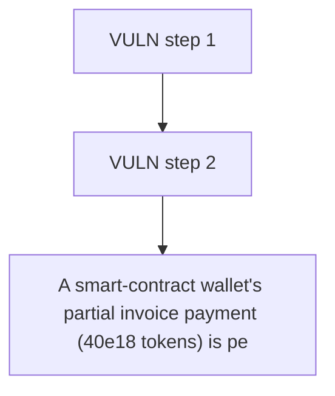

# Etherspot: A smart-contract wallet's partial invoice payment (40e18 tokens) is permanently locked in 

> **Vulnerability classes:** vuln/locked-funds
>
> **Reproduction:** a faithful minimal reproduction of the vulnerable finding — the vulnerable function is reproduced **verbatim** (marked `@>`) with faithful minimal doubles; local deploy, no fork.

<!-- source-auditvault: https://github.com/Auditware/AuditVault/blob/main/findings/62849-h-02-paid-tokens-by-smart-contract-wallets-are-not-refunded.md -->

## Root cause

A smart-contract wallet's partial invoice payment (40e18 tokens) is permanently locked in InvoiceManager when a SETTLER cancels the stuck invoice: cancelInvoice deletes all credited-token accounting with no refund to the paying wallet, and the only exit (emergencyWithdraw) sweeps to the admin.

```solidity
    }

    // ─────────────── VERBATIM from InvoiceManager.sol L272-279 ───────────────
    // The only exit for stranded tokens: sweeps to the admin (msg.sender), NOT
    // back to the paying smart wallet. Not a refund path for the SCW.
    function emergencyWithdraw(address _token, uint256 _amount) external onlyRole(DEFAULT_ADMIN_ROLE) {
```

## Why it's exploitable here

A smart-contract wallet's partial invoice payment (40e18 tokens) is permanently locked in InvoiceManager when a SETTLER cancels the stuck invoice: cancelInvoice deletes all credited-token accounting with no refund to the paying wallet, and the only exit (emergencyWithdraw) sweeps to the admin.

## Attack path



## Marked-line walkthrough (Playground)

The EVM Playground pins each step to the exact executed source line in `0xce01759b82…`:

1. **L305** — VULN step 1: wipes all credited-token accounting; tokens the SCW already paid in are NEVER refunded
2. **L308** — VULN step 2: wipes all credited-token accounting; tokens the SCW already paid in are NEVER refunded

## PoC

Registry (Foundry, local deploy — verbatim vulnerable source + harm-asserting test + negative control):

```bash
cd 62849-h-02-paid-tokens-by-smart-contract-wallets-are-not-refunded_exp
forge test -vvv
```

The browser Playground replays the same synthetic opcode-for-opcode and measures the harm: **A smart-contract wallet's partial invoice payment (40e18 tokens) is permanently locked in InvoiceManager when a SETTLER cancels the stuck in**. Both gates are green (registry `forge test` PASS + Playground `_verify-poc` **VERDICT: PASS**).
