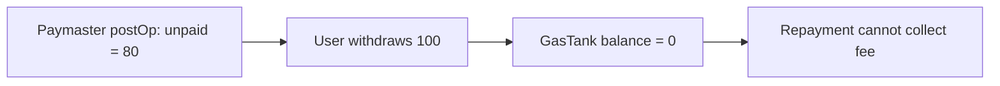

# Etherspot GasTankPaymaster — user withdraws before sponsored gas repayment

> **Vulnerability classes:** vuln/logic/state-update · vuln/dos/frozen-funds
>
> **Reproduction:** local synthetic Foundry reduction; the complete passing trace is in [output.txt](output.txt).

<!-- non-defihacklabs -->
<!-- source-auditvault: https://github.com/Auditware/AuditVault/blob/main/findings/62850-h-03-users-can-escape-paying-for-the-tx-gas-shieldify-none-e.md -->
<!-- date: 2025-01 -->

## Key info

| Field | Value |
|---|---|
| Loss | The user withdraws 100 units while 80 units of sponsored gas remain unpaid. |
| Vulnerable contract | `GasTank.withdraw` in [test/62850-h-03-users-escape-paying-tx-gas.sol](test/62850-h-03-users-escape-paying-tx-gas.sol) |
| Attacker EOA | `0x1111111111111111111111111111111111111111` |
| Attack contract | `Exploit` |
| Attack tx | Local Foundry `Exploit.run()` |
| Chain · block · date | Ethereum model · block 0 · synthetic |
| Compiler | Solidity `^0.8.24` |
| Bug class | Withdrawal does not account for outstanding sponsored gas |

## TL;DR

`postOp` records a user's gas debt, but `withdraw` remains unrestricted. The user can empty the GasTank before the asynchronous repayment job runs, leaving the paymaster unable to collect fees.

## Background

The audited design settles paymaster gas after execution from an emitted event. Until repayment, the user's balance must be reserved or withdrawals paused.

## The vulnerable code

```solidity
function withdraw(uint256 amount) external {
    require(balances[msg.sender] >= amount, "insufficient");
    // @> VULN: withdrawal ignores unpaid sponsored transactions.
    balances[msg.sender] -= amount;
}
```

## Root cause

The balance used for withdrawal is not reduced or locked when `postOp` records gas. A later withdrawal can race the administrative repayment.

## Preconditions

- The user has a funded GasTank balance.
- A sponsored operation has completed and produced an unpaid gas amount.
- Repayment is asynchronous and withdrawal has no pending-debt check.

## Attack walkthrough

1. The user deposits 100 units and `postOp` records 80 units owed.
2. The same user calls `withdraw(100)` before repayment.
3. Balance reaches zero while `unpaid` remains 80; the passing assertion is at [output.txt:4](output.txt#L4).

## Diagrams



## Remediation

Track a reserved/pending amount per user, block or cap withdrawals while it is nonzero, and clear the reservation atomically only when repayment succeeds. For cross-chain settlement, reserve before execution.

## How to reproduce

```bash
cd evm-hack-registry/62850-h-03-users-escape-paying-tx-gas_exp
forge test -vvvvv
```

## Sources

- [AuditVault finding #62850](https://github.com/Auditware/AuditVault/blob/main/findings/62850-h-03-users-can-escape-paying-for-the-tx-gas-shieldify-none-e.md)
- [Shieldify Etherspot GasTank review](https://github.com/shieldify-security/audits-portfolio-md/blob/main/Etherspot-GasTankPaymasterModule-Extended-Security-Review.md)
- [Synthetic test](test/62850-h-03-users-escape-paying-tx-gas.sol)

*Reference: https://github.com/shieldify-security/audits-portfolio-md/blob/main/Etherspot-GasTankPaymasterModule-Extended-Security-Review.md*
