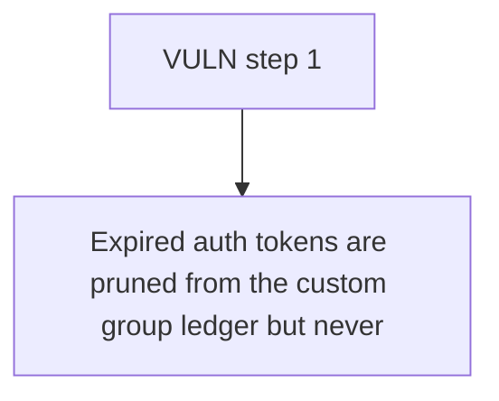

# Radius Technology: Expired auth tokens are pruned from the custom group ledger but never burned from the auth

> **Vulnerability classes:** vuln/locked-funds · vuln/access-control
>
> **Reproduction:** a faithful minimal reproduction of the vulnerable finding — the vulnerable function is reproduced **verbatim** (marked `@>`) with faithful minimal doubles; local deploy, no fork.

<!-- source-auditvault: https://github.com/Auditware/AuditVault/blob/main/findings/62866-expired-token-groups-not-synchronized-with-erc1155-balance-t.md -->

## Root cause

Expired auth tokens are pruned from the custom group ledger but never burned from the authoritative ERC1155 balance, so 50 phantom expired tokens remain transferable and are moved to the sink (should have been destroyed).

```solidity
        }
        // If any expired groups were removed, emit an event with the total amount of expired tokens
        if (expiredAmount > 0) {
            emit ExpiredTokensBurned(account, id, expiredAmount); // @> removes expired records and emits "burned", but NEVER burns the underlying ERC1155 balance -> phantom balance stays transferable
        }
    }
```

## Why it's exploitable here

Expired auth tokens are pruned from the custom group ledger but never burned from the authoritative ERC1155 balance, so 50 phantom expired tokens remain transferable and are moved to the sink (should have been destroyed).

## Attack path



## Marked-line walkthrough (Playground)

The EVM Playground pins each step to the exact executed source line in `0x8ea53755a6…`:

1. **L157** — VULN step 1: removes expired records and emits "burned", but NEVER burns the underlying ERC1155 balance -> phantom balance stays transferable

## PoC

Registry (Foundry, local deploy — verbatim vulnerable source + harm-asserting test + negative control):

```bash
cd 62866-expired-token-groups-not-synchronized-with-erc1155-balance-t_exp
forge test -vvv
```

The browser Playground replays the same synthetic opcode-for-opcode and measures the harm: **Expired auth tokens are pruned from the custom group ledger but never burned from the authoritative ERC1155 balance, so 50 phantom expired t**. Both gates are green (registry `forge test` PASS + Playground `_verify-poc` **VERDICT: PASS**).
