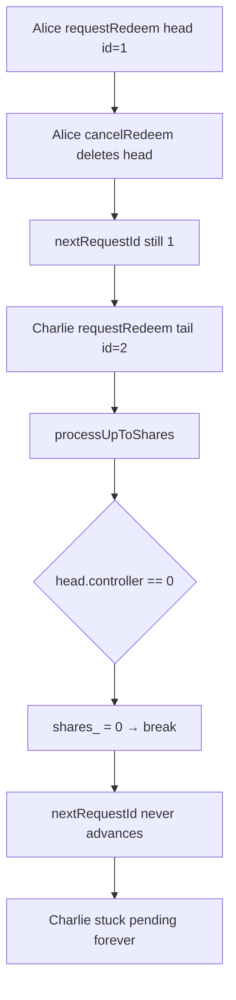

# Accountable — Cancelling redeem requests permanently blocks the withdrawal queue

> **Vulnerability classes:** vuln/liveness/queue-deadlock · vuln/logic/pointer-not-advanced · frozen-funds

> **Reproduction:** a self-contained Foundry PoC that compiles & runs in an
> isolated project with **only `forge-std`** — no fork, no RPC, no `anvil_state`.
> Full trace: [output.txt](output.txt). PoC:
> [test/62968-cancelling-redeem-requests-permanently-blocks-the-withdrawal_exp.sol](test/62968-cancelling-redeem-requests-permanently-blocks-the-withdrawal_exp.sol).

<!-- non-defihacklabs -->
<!-- source-auditvault: https://github.com/Auditware/AuditVault/blob/main/findings/62968-cancelling-redeem-requests-permanently-blocks-the-withdrawal.md -->
<!-- date: 2025-10 -->

**AuditVault taxonomy:** `severity/high` · `sector/lending` · `sector/staking` · `platform/cyfrin` · `frozen-funds` · `permanent` · `cross-contract-state-consistency`

---

## Key info

| | |
|---|---|
| **Impact** | **HIGH** — withdrawal queue permanently stuck; no subsequent user can withdraw |
| **Protocol** | Accountable (credit vaults) — `AccountableWithdrawalQueue` |
| **Vulnerable code** | `AccountableWithdrawalQueue::_processUpToShares` — `if (shares_ == 0) break;` before advancing `nextRequestId` |
| **Bug class** | Empty-head queue deadlock (pointer not advanced on deleted entry) |
| **Finding** | Cyfrin 2025-10-16 Accountable v2.0 · #62968 · reporter **Immeas** |
| **Report** | [Cyfrin Accountable v2.0](https://github.com/solodit/solodit_content/blob/main/reports/Cyfrin/2025-10-16-cyfrin-accountable-v2.0.md) |
| **Source** | [AuditVault](https://github.com/Auditware/AuditVault/blob/main/findings/62968-cancelling-redeem-requests-permanently-blocks-the-withdrawal.md) |
| **Status** | Audit finding — fixed by Accountable; verified by Cyfrin. Reproduced as a standalone local PoC. |
| **Compiler** | `^0.8.24` (PoC) |

---

## TL;DR

1. Redeem requests sit in a FIFO queue keyed by `nextRequestId` (head).
2. Cancelling a request fully deletes the entry (`controller = address(0)`) without advancing the head.
3. Processing reads the empty head, `_processRequest` returns `(0, 0, true)`, and the outer loop does `if (shares_ == 0) break` **before** `++nextRequestId`.
4. Every later process call deadlocks on the same empty head; tail redeemers never become claimable.

---

## The vulnerable code

```solidity
(uint256 shares_, uint256 assets_, bool processed_) =
    _processRequest(request_, liquidity, maxShares_, precision_);

if (shares_ == 0) break; // @> VULN: empty head returns (0,0,true) but break skips ++nextRequestId
// FIX: if (shares_ == 0) { if (processed_) { ++nextRequestId; continue; } break; }
```

---

## Root cause

Deleted head slots are treated as “processed” but the loop still breaks on `shares_ == 0` without advancing the pointer. The cancel path clears storage without moving `nextRequestId`, so a single dust cancel at the head bricks the entire queue.

## Preconditions

- Instant (or any) cancel path that fully deletes a request currently at the head.
- At least one subsequent redeem request enqueued behind the deleted head.

## Attack walkthrough

1. Alice enqueues a tiny redeem → becomes head (`requestId = 1`).
2. Alice cancels; head entry deleted; `nextRequestId` stays `1`.
3. Charlie enqueues a large, fully funded redeem (`requestId = 2`).
4. `processUpToShares` / `processUpToRequestId` hit empty head, break, return 0.
5. Charlie remains fully pending and unclaimable forever.

## Diagrams



## Impact

Permanent liveness failure of the withdrawal queue. All subsequent redeemers cannot exit; funds remain locked behind a bricked head pointer.

## Sources

- [AuditVault finding #62968](https://github.com/Auditware/AuditVault/blob/main/findings/62968-cancelling-redeem-requests-permanently-blocks-the-withdrawal.md)
- [Cyfrin Accountable v2.0 report](https://github.com/solodit/solodit_content/blob/main/reports/Cyfrin/2025-10-16-cyfrin-accountable-v2.0.md)
- Reduced source: Accountable-Protocol `AccountableWithdrawalQueue.sol` @ `fc43546` — `_processUpToShares` / `_delete`
