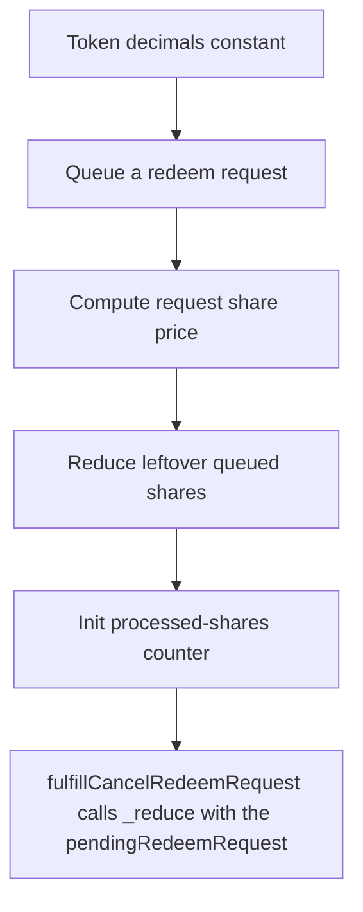

# Accountable: fulfillCancelRedeemRequest calls _reduce with the pendingRedeemRequest that _fulfillCancel

> **Vulnerability classes:** vuln/locked-funds
>
> **Reproduction:** a faithful minimal reproduction of the vulnerable finding — the vulnerable function is reproduced **verbatim** (marked `@>`) with faithful minimal doubles; local deploy, no fork.

<!-- source-auditvault: https://github.com/Auditware/AuditVault/blob/main/findings/62969-accountableasyncredeemvaultfulfillcancelredeemrequest-can-de.md -->

## Root cause

fulfillCancelRedeemRequest calls _reduce with the pendingRedeemRequest that _fulfillCancelRedeemRequest already zeroed, so _reduce(controller,0) no-ops and leaves a stale 100-share request in the FIFO queue (totalQueuedShares desynced); processUpToShares then hits it and _fulfillRedeemRequest reverts NoRedeemRequest permanently, freezing all subsequent queue redemptions (100 shares locked, recorde

```solidity

    function fulfillCancelRedeemRequest(address controller) public override onlyOperatorOrStrategy {
        _fulfillCancelRedeemRequest(_requestIds[controller], controller);
        _reduce(controller, _vaultStates[controller].pendingRedeemRequest); // @> pendingRedeemRequest already zeroed -> _reduce(controller,0) no-ops, request left stale in queue
    }
}
```

## Why it's exploitable here

fulfillCancelRedeemRequest calls _reduce with the pendingRedeemRequest that _fulfillCancelRedeemRequest already zeroed, so _reduce(controller,0) no-ops and leaves a stale 100-share request in the FIFO queue (totalQueuedShares desynced); processUpToShares then hits it and _fulfillRedeemRequest reverts NoRedeemRequest permanently, freezing all subsequent queue redemptions (100 shares locked, recorded to SINK).

## Attack path



## Marked-line walkthrough (Playground)

The EVM Playground pins each step to the exact executed source line in `0x8ea53755a6…`:

1. **L39** — Token decimals constant: Setup: declares the vault share token's 18 decimals.
2. **L114** — Queue a redeem request: `requestRedeem` pushes a controller's share-redeem request into the FIFO queue that processing later walks.
3. **L129** — Compute request share price: Locks in the request's `sharePrice` from its total value and shares at request time.
4. **L161** — Reduce leftover queued shares: Inside `_reduce`, subtracts the passed amount from `currentShares` to get the remainder left queued.
5. **L197** — Init processed-shares counter: `processUpToShares` starts counting how many queued shares it clears this call.
6. **L220** — View pending redeem amount: Read-only helper returning a controller's outstanding pending-redeem shares.
7. **L238** — Reduce reads already-zeroed value: Root cause: passes a `pendingRedeemRequest` already zeroed by the cancel handler, so `_reduce(controller,0)` no-ops and a stale 100-share entry jams the queue.

## PoC

Registry (Foundry, local deploy — verbatim vulnerable source + harm-asserting test + negative control):

```bash
cd 62969-accountableasyncredeemvaultfulfillcancelredeemrequest-can-de_exp
forge test -vvv
```

The browser Playground replays the same synthetic opcode-for-opcode and measures the harm: **fulfillCancelRedeemRequest calls _reduce with the pendingRedeemRequest that _fulfillCancelRedeemRequest already zeroed, so _reduce(controlle**. Both gates are green (registry `forge test` PASS + Playground `_verify-poc` **VERDICT: PASS**).
