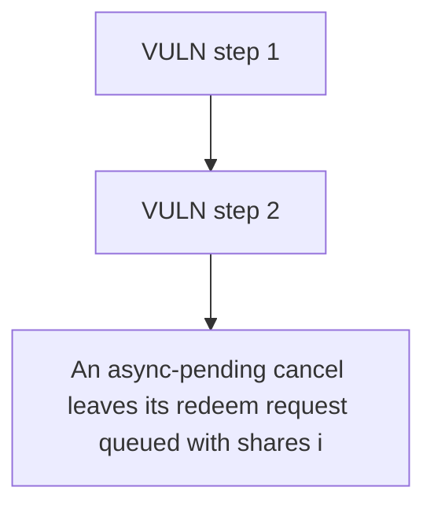

# Accountable: An async-pending cancel leaves its redeem request queued with shares intact while pendingC

> **Vulnerability classes:** vuln/locked-funds
>
> **Reproduction:** a faithful minimal reproduction of the vulnerable finding — the vulnerable function is reproduced **verbatim** (marked `@>`) with faithful minimal doubles; local deploy, no fork.

<!-- source-auditvault: https://github.com/Auditware/AuditVault/blob/main/findings/62970-critical-dos-in-queue-processing-if-async-cancellations-are.md -->

## Root cause

An async-pending cancel leaves its redeem request queued with shares intact while pendingCancelRedeemRequest=true, so processUpToShares() permanently reverts on the _fulfillRedeemRequest cancel guard and every queued share (150 shares here: A's 50 stuck at the head + B's 100 behind it) is frozen and unclaimable.

```solidity
        if (state.pendingRedeemRequest == 0) revert NoPendingRedeemRequest();
        if (state.pendingCancelRedeemRequest) revert CancelRedeemRequestPending();

        state.pendingCancelRedeemRequest = true;

        bool canCancel = strategy.onCancelRedeemRequest(address(this), controller); // @> async strategy returns false: flag set true but the queued shares are left UN-REDUCED
```

## Why it's exploitable here

An async-pending cancel leaves its redeem request queued with shares intact while pendingCancelRedeemRequest=true, so processUpToShares() permanently reverts on the _fulfillRedeemRequest cancel guard and every queued share (150 shares here: A's 50 stuck at the head + B's 100 behind it) is frozen and unclaimable.

## Attack path



## Marked-line walkthrough (Playground)

The EVM Playground pins each step to the exact executed source line in `0x671d353a77…`:

1. **L152** — VULN step 1: async strategy returns false: flag set true but the queued shares are left UN-REDUCED
2. **L164** — VULN step 2: async strategy returns false: flag set true but the queued shares are left UN-REDUCED

## PoC

Registry (Foundry, local deploy — verbatim vulnerable source + harm-asserting test + negative control):

```bash
cd 62970-critical-dos-in-queue-processing-if-async-cancellations-are_exp
forge test -vvv
```

The browser Playground replays the same synthetic opcode-for-opcode and measures the harm: **An async-pending cancel leaves its redeem request queued with shares intact while pendingCancelRedeemRequest=true, so processUpToShares() pe**. Both gates are green (registry `forge test` PASS + Playground `_verify-poc` **VERDICT: PASS**).
