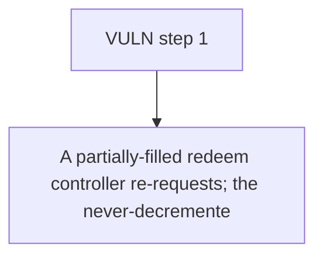

# Accountable: A partially-filled redeem controller re-requests; the never-decremented request.totalValue

> **Vulnerability classes:** vuln/theft · vuln/locked-funds · vuln/unfair-mint · vuln/price
>
> **Reproduction:** a faithful minimal reproduction of the vulnerable finding — the vulnerable function is reproduced **verbatim** (marked `@>`) with faithful minimal doubles; local deploy, no fork.

<!-- source-auditvault: https://github.com/Auditware/AuditVault/blob/main/findings/62971-partial-redemptions-can-be-used-to-steal-assets-cyfrin-none.md -->

## Root cause

A partially-filled redeem controller re-requests; the never-decremented request.totalValue inflates the averaged request.sharePrice, crediting ~500 assets for 200 shares worth 400 at true price 2, letting the controller drain the ~100 surplus base-assets from the pooled vault to the attacker EOA.

```solidity
        if (remainingShares == 0) {
            _delete(controller, requestId);
        } else {
            _queue.requests[requestId].shares = remainingShares; // @> totalValue is NOT decremented here — it stays inflated after a partial fill
        } // @audit the totalValue is not updated here.
    }
```

## Why it's exploitable here

A partially-filled redeem controller re-requests; the never-decremented request.totalValue inflates the averaged request.sharePrice, crediting ~500 assets for 200 shares worth 400 at true price 2, letting the controller drain the ~100 surplus base-assets from the pooled vault to the attacker EOA.

## Attack path



## Marked-line walkthrough (Playground)

The EVM Playground pins each step to the exact executed source line in `0x671d353a77…`:

1. **L184** — VULN step 1: totalValue is NOT decremented here — it stays inflated after a partial fill

## PoC

Registry (Foundry, local deploy — verbatim vulnerable source + harm-asserting test + negative control):

```bash
cd 62971-partial-redemptions-can-be-used-to-steal-assets-cyfrin-none_exp
forge test -vvv
```

The browser Playground replays the same synthetic opcode-for-opcode and measures the harm: **A partially-filled redeem controller re-requests; the never-decremented request.totalValue inflates the averaged request.sharePrice, crediti**. Both gates are green (registry `forge test` PASS + Playground `_verify-poc` **VERDICT: PASS**).
