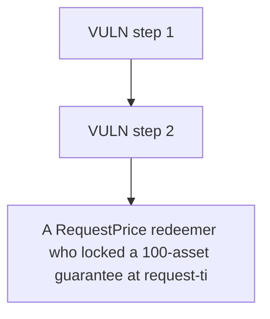

# Accountable: A RequestPrice redeemer who locked a 100-asset guarantee at request-time price (1e18) is s

> **Vulnerability classes:** vuln/locked-funds · vuln/price
>
> **Reproduction:** a faithful minimal reproduction of the vulnerable finding — the vulnerable function is reproduced **verbatim** (marked `@>`) with faithful minimal doubles; local deploy, no fork.

<!-- source-auditvault: https://github.com/Auditware/AuditVault/blob/main/findings/62972-accountableasyncredeemvaultfulfillredeemrequest-ignores-proc.md -->

## Root cause

A RequestPrice redeemer who locked a 100-asset guarantee at request-time price (1e18) is settled at the lower fulfilment-time price (0.5e18) and paid only 50 assets, losing 50 that stay retained in the vault for the remaining holders.

```solidity

// ─────────────────────────────────────────────────────────────────────────────
// VULNERABLE vault. fulfillRedeemRequest body is VERBATIM from the finding:
// it passes sharePrice() (the CURRENT price) instead of the stored request price.
// ─────────────────────────────────────────────────────────────────────────────
contract AccountableAsyncRedeemVault is AccountableAsyncRedeemVaultBase {
```

## Why it's exploitable here

A RequestPrice redeemer who locked a 100-asset guarantee at request-time price (1e18) is settled at the lower fulfilment-time price (0.5e18) and paid only 50 assets, losing 50 that stay retained in the vault for the remaining holders.

## Attack path



## Marked-line walkthrough (Playground)

The EVM Playground pins each step to the exact executed source line in `0x671d353a77…`:

1. **L177** — VULN step 1: ignores processingMode==RequestPrice: uses CURRENT sharePrice() not stored request.sharePrice
2. **L192** — VULN step 2: ignores processingMode==RequestPrice: uses CURRENT sharePrice() not stored request.sharePrice

## PoC

Registry (Foundry, local deploy — verbatim vulnerable source + harm-asserting test + negative control):

```bash
cd 62972-accountableasyncredeemvaultfulfillredeemrequest-ignores-proc_exp
forge test -vvv
```

The browser Playground replays the same synthetic opcode-for-opcode and measures the harm: **A RequestPrice redeemer who locked a 100-asset guarantee at request-time price (1e18) is settled at the lower fulfilment-time price (0.5e18)**. Both gates are green (registry `forge test` PASS + Playground `_verify-poc` **VERDICT: PASS**).
