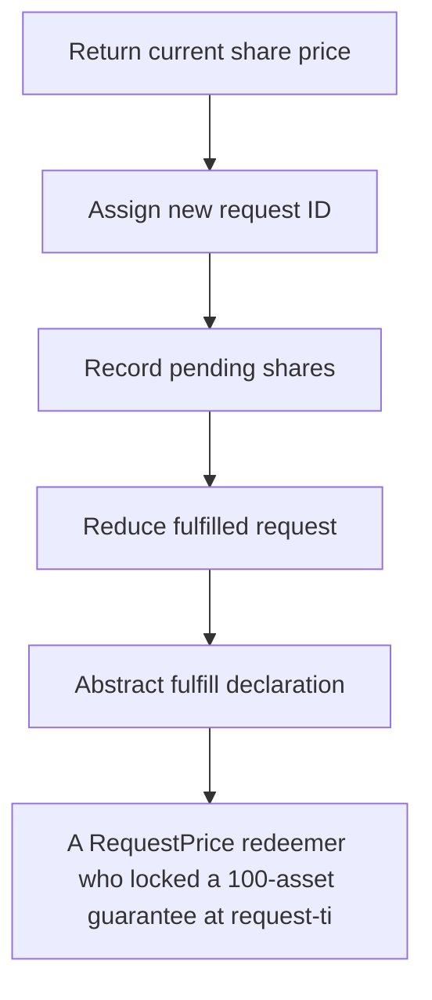

# Accountable: A RequestPrice redeemer who locked a 100-asset guarantee at request-time price (1e18) is s

> **Vulnerability classes:** vuln/locked-funds · vuln/price
>
> **Reproduction:** a faithful minimal reproduction of the vulnerable finding — the vulnerable function is reproduced **verbatim** (marked `@>`) with faithful minimal doubles; local deploy, no fork.

<!-- source-auditvault: https://github.com/Auditware/AuditVault/blob/main/findings/62972-accountableasyncredeemvaultfulfillredeemrequest-ignores-proc.md -->

## Root cause

A RequestPrice redeemer who locked a 100-asset guarantee at request-time price (1e18) is settled at the lower fulfilment-time price (0.5e18) and paid only 50 assets, losing 50 that stay retained in the vault for the remaining holders.

```solidity

// ─────────────────────────────────────────────────────────────────────────────
// VULNERABLE vault. fulfillRedeemRequest body is VERBATIM from the finding:
// it passes sharePrice() (the CURRENT price) instead of the stored request price.
// ─────────────────────────────────────────────────────────────────────────────
contract AccountableAsyncRedeemVault is AccountableAsyncRedeemVaultBase {
```

## Why it's exploitable here

A RequestPrice redeemer who locked a 100-asset guarantee at request-time price (1e18) is settled at the lower fulfilment-time price (0.5e18) and paid only 50 assets, losing 50 that stay retained in the vault for the remaining holders.

## Attack path



## Marked-line walkthrough (Playground)

The EVM Playground pins each step to the exact executed source line in `0x671d353a77…`:

1. **L119** — Return current share price: Returns the vault's live `_currentSharePrice` — the fulfilment-time price wrongly used to settle request-price redeems.
2. **L132** — Assign new request ID: Increments `_nextRequestId` to tag a fresh redeem request.
3. **L144** — Record pending shares: Adds the caller's shares to `pendingShares` when a redeem request is opened.
4. **L155** — Reduce fulfilled request: `_reduce` decrements a controller's request as its shares get fulfilled.
5. **L167** — Abstract fulfill declaration: Declares the virtual `fulfillRedeemRequest` that concrete strategies must implement.
6. **L171** — Read request-time locked price: Returns the request's stored `sharePrice` — the 1e18 guarantee that fulfilment ignores when the market price drops.
7. **L195** — Fulfill ignores locked price: Root cause: this `fulfillRedeemRequest` settles at fulfilment-time price instead of the request's locked price, underpaying the redeemer 50 assets.

## PoC

Registry (Foundry, local deploy — verbatim vulnerable source + harm-asserting test + negative control):

```bash
cd 62972-accountableasyncredeemvaultfulfillredeemrequest-ignores-proc_exp
forge test -vvv
```

The browser Playground replays the same synthetic opcode-for-opcode and measures the harm: **A RequestPrice redeemer who locked a 100-asset guarantee at request-time price (1e18) is settled at the lower fulfilment-time price (0.5e18)**. Both gates are green (registry `forge test` PASS + Playground `_verify-poc` **VERDICT: PASS**).
