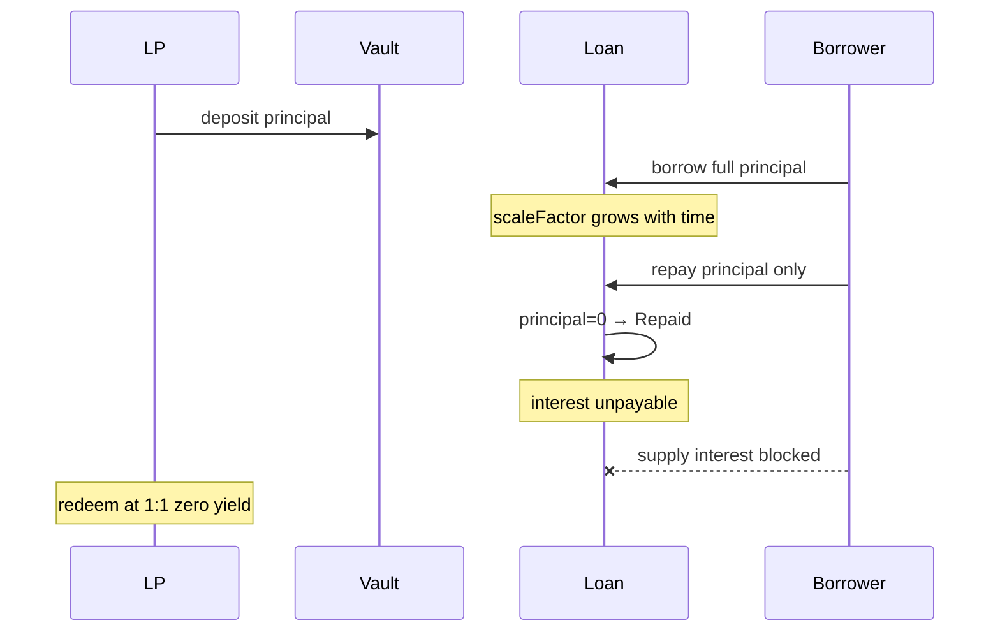

# Accountable — `AccountableOpenTerm` interest cannot be repaid once principal hits zero

> **Vulnerability classes:** vuln/logic/debt-accounting · fee-theft · debt-accrual-update

> **Reproduction:** a self-contained Foundry PoC that compiles & runs in an
> isolated project with **only `forge-std`** — no fork, no RPC, no `anvil_state`.
> Full trace: [output.txt](output.txt). PoC:
> [test/62973-accountableopenterm-loan-interest-cannot-be-repaid-once-prin_exp.sol](test/62973-accountableopenterm-loan-interest-cannot-be-repaid-once-prin_exp.sol).

<!-- non-defihacklabs -->
<!-- source-auditvault: https://github.com/Auditware/AuditVault/blob/main/findings/62973-accountableopenterm-loan-interest-cannot-be-repaid-once-prin.md -->
<!-- date: 2025-10 -->

**AuditVault taxonomy:** `severity/high` · `sector/lending` · `sector/stable` · `platform/cyfrin` · `decimal-mismatch` · `fee-theft` · `debt-accrual-update` · `fee-accounting`

---

## Key info

| | |
|---|---|
| **Impact** | **HIGH** — accrued interest permanently forgiven; LPs receive principal only |
| **Protocol** | Accountable — `AccountableOpenTerm` |
| **Vulnerable code** | `repay()` marks `loanState = Repaid` when `outstandingPrincipal` hits zero without collecting scale-factor interest |
| **Bug class** | Principal-first debt model leaves virtual interest unpayable after Repaid |
| **Finding** | Cyfrin 2025-10-16 Accountable v2.0 · #62973 · reporter **Immeas** |
| **Report** | [Cyfrin Accountable v2.0](https://github.com/solodit/solodit_content/blob/main/reports/Cyfrin/2025-10-16-cyfrin-accountable-v2.0.md) |
| **Source** | [AuditVault](https://github.com/Auditware/AuditVault/blob/main/findings/62973-accountableopenterm-loan-interest-cannot-be-repaid-once-prin.md) |
| **Status** | Audit finding — fixed (debt shares). Reproduced as a standalone local PoC. |
| **Compiler** | `^0.8.24` (PoC) |

---

## TL;DR

1. Interest accrues virtually via `_scaleFactor` / `scaleFactor`.
2. `repay()` only reduces `outstandingPrincipal`; excess for interest is optional.
3. When principal reaches zero the loan flips to `Repaid`.
4. In `Repaid`, `_requireLoanOngoing()` blocks further `supply`/`repay`, and `sharePrice` falls back to `assetShareRatio` (ignores scale factor).
5. All accrued interest is permanently unpayable — LPs get 0 yield.

---

## The vulnerable code

```solidity
if (assets >= outstandingPrincipal) {
    outstandingPrincipal = 0;
    loanState = LoanState.Repaid; // @> VULN: principal-zero → Repaid without requiring interest
    // FIX: burn debt shares at current scaleFactor; Repaid only when debtShares == 0
}
```

---

## Root cause

Liability is tracked as principal with a separate virtual scale factor, but the only funding paths reduce principal first. Hitting principal zero is treated as full repayment even when scale factor implies unpaid interest.

## Preconditions

- Open-term loan with positive interest rate; principal outstanding.
- Time passes so `scaleFactor > PRECISION`.
- Borrower repays exactly principal (maliciously or accidentally).

## Attack walkthrough

1. LP deposits `USDC_AMOUNT`; borrower draws full principal.
2. Accrue ~180 days of interest → `scaleFactor > 1e36`.
3. Borrower repays exactly principal → `loanState = Repaid`.
4. `sharePrice` returns 1:1 `assetShareRatio` (no interest realized).
5. Further `supply(1)` reverts via `_requireLoanOngoing()`.

## Diagrams



## Impact

LPs systematically underpaid; a borrower can always avoid interest by repaying principal before realizing it. Unintentional last payments that exhaust principal have the same effect.

## Sources

- [AuditVault finding #62973](https://github.com/Auditware/AuditVault/blob/main/findings/62973-accountableopenterm-loan-interest-cannot-be-repaid-once-prin.md)
- [Cyfrin Accountable v2.0 report](https://github.com/solodit/solodit_content/blob/main/reports/Cyfrin/2025-10-16-cyfrin-accountable-v2.0.md)
- Reduced source: Accountable-Protocol `AccountableOpenTerm` — `repay` / `_requireLoanOngoing` / `sharePrice` (fixed in `fce6961`, `8e53eba`)
