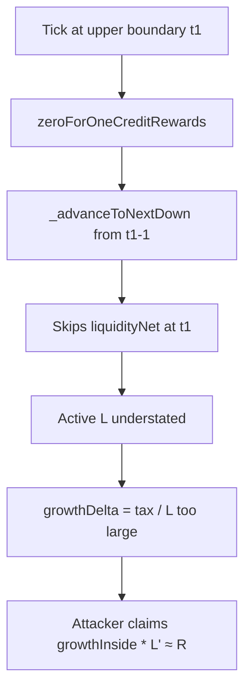

# Sorella L2 Angstrom — All rewards can be stolen via incorrect active liquidity at boundary ticks

> **Vulnerability classes:** vuln/arithmetic/underflow · vuln/logic/reward-calculation · reward-theft

> **Reproduction:** a self-contained Foundry PoC that compiles & runs in an
> isolated project with **only `forge-std`** — no fork, no RPC, no `anvil_state`.
> Full trace: [output.txt](output.txt). PoC:
> [test/63008-all-rewards-can-be-stolen-due-to-incorrect-active-liquidity_exp.sol](test/63008-all-rewards-can-be-stolen-due-to-incorrect-active-liquidity_exp.sol).

<!-- non-defihacklabs -->
<!-- source-auditvault: https://github.com/Auditware/AuditVault/blob/main/findings/63008-all-rewards-can-be-stolen-due-to-incorrect-active-liquidity.md -->
<!-- date: 2025-10 -->

**AuditVault taxonomy:** `severity/high` · `sector/dex` · `platform/cyfrin` · `underflow` · `reward-calculation` · `reward-theft` · `known-pattern` · `integer-bounds` · `reward-accounting`

---

## Key info

| | |
|---|---|
| **Impact** | **HIGH** — attacker steals essentially all pending swap-tax rewards |
| **Protocol** | Sorella L2 Angstrom |
| **Vulnerable code** | `TickIterator::_advanceToNextDown` — compresses `(currentTick - 1)`, skipping boundary tick net liquidity |
| **Bug class** | Off-by-one tick iterator → understated active L → inflated growth-per-liquidity |
| **Finding** | Cyfrin 2025-10-01 Sorella L2 Angstrom v2.1 · #63008 · reporter **Giovanni Di Siena** |
| **Report** | [Cyfrin Sorella L2 Angstrom](https://github.com/solodit/solodit_content/blob/main/reports/Cyfrin/2025-10-01-cyfrin-sorella-l2-angstrom-v2.1.md) |
| **Source** | [AuditVault](https://github.com/Auditware/AuditVault/blob/main/findings/63008-all-rewards-can-be-stolen-due-to-incorrect-active-liquidity.md) |
| **Status** | Audit finding — fixed in `c01b6c7`. Reproduced as a reduced local synthetic of the reward-theft math. |
| **Compiler** | `^0.8.24` (PoC) |

---

## TL;DR

1. When the current tick is an exact multiple of tick spacing at an upper liquidity bound `t1`, zero-for-one iteration should apply `liquidityNet[t1]` first.
2. `_advanceToNextDown` starts from `currentTick - 1`, so `t1` is skipped.
3. Active liquidity used for reward growth is understated; `cumulativeGrowthX128` is too large.
4. An attacker JIT-adds liquidity in `[t1 - s, t1)`, triggers the buggy credit path, and claims ~all rewards `R`.

---

## The vulnerable code

```solidity
function _advanceToNextDown(TickIteratorDown memory self) private view {
    // ...
    int24 cursor = fromTick - 1; // @> VULN: skips boundary tick when currentTick == t1
    // FIX: seed inclusive of boundary / apply net liquidity before advancing
}
```

---

## Root cause

Boundary-tick off-by-one in the down iterator. Liquidity that becomes active when leaving the upper bound is never folded into the reward growth denominator, so growth-per-unit-liquidity is inflated exactly in the window an attacker can occupy.

## Preconditions

- Current tick sits on (or is swapped to) an upper range boundary multiple of tick spacing.
- Non-zero pending rewards / swap tax to distribute.
- Attacker can add liquidity in the one-spacing range below the boundary and swap zero-for-one across it.

## Attack walkthrough

1. Honest LP holds wide-range liquidity; rewards accumulate to balance `R`.
2. Attacker moves tick to boundary `t1` and adds `L' ≈ L` on `[t1 - s, t1)`.
3. Zero-for-one reward credit uses understated active `L` (skips attacker net at `t1`).
4. Growth inside attacker range ≈ full inflated global growth → claim ≈ `R`.
5. Honest LP is left with little/no residual reward.

## Diagrams



## Impact

All pending rewards can be stolen at a profit (net of JIT/swap tax). Secondary impact: swaps can underflow on liquidity decrement when overlapping liquidity is insufficient.

## Sources

- [AuditVault finding #63008](https://github.com/Auditware/AuditVault/blob/main/findings/63008-all-rewards-can-be-stolen-due-to-incorrect-active-liquidity.md)
- [Cyfrin Sorella L2 Angstrom v2.1](https://github.com/solodit/solodit_content/blob/main/reports/Cyfrin/2025-10-01-cyfrin-sorella-l2-angstrom-v2.1.md)
- Reduced source: sorellaLabs/l2-angstrom @ `386baff` — `TickIterator::_advanceToNextDown`, `AngstromL2::_zeroForOneCreditRewards` (fix `c01b6c7`)
