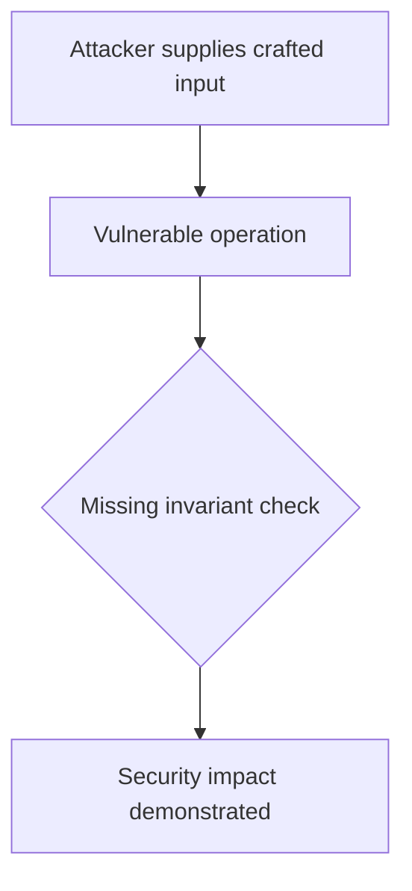
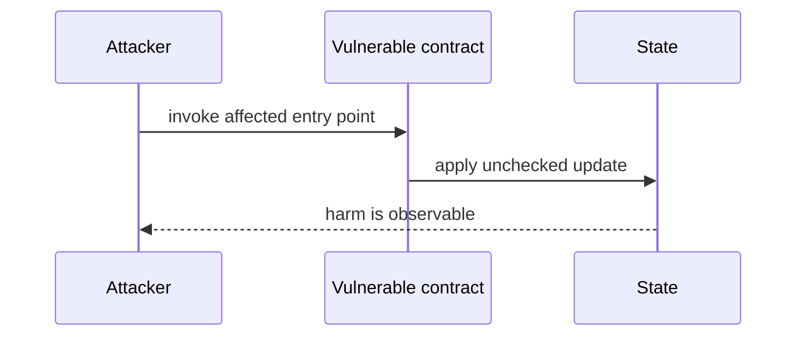

# Caller-supplied ControlTower grants migrator power — AuditVault synthetic reduction

> **Vulnerability classes:** vuln/access-control/missing-auth · vuln/input-validation/missing
>
> **Reproduction:** self-contained Foundry PoC with an offline synthetic contract. Full trace: [output.txt](output.txt).

<!-- non-defihacklabs -->
<!-- source-auditvault: https://github.com/Auditware/AuditVault/blob/main/findings/63046-h-2-caller-supplied-controltower-lets-anyone-be-the-migrator.md -->
<!-- date: 2025-08 -->

**AuditVault finding:** `63046` · `H-2: Caller supplied `ControlTower` lets anyone be the migrator`

## Key info

| | |
|---|---|
| **Impact** | **HIGH** — Caller-supplied ControlTower grants migrator power |
| **Protocol** | [[USG]] - Tangent |
| **Finding** | AuditVault #63046 |
| **Report** | [https://github.com/sherlock-audit/2025-08-usg-tangent-judging](https://github.com/sherlock-audit/2025-08-usg-tangent-judging) |
| **Source** | [AuditVault finding](https://github.com/Auditware/AuditVault/blob/main/findings/63046-h-2-caller-supplied-controltower-lets-anyone-be-the-migrator.md) |
| **Compiler** | `^0.8.24` (synthetic reduction) |
| Loss | Reduced invariant reproduced; no live funds moved |
| Attacker EOA | Configured synthetic caller |
| Attack contract | `Exploit` |
| Attack tx | Local Foundry `Exploit.attack()` call |
| Chain · block · date | Ethereum model · block 1 · synthetic |
| Vulnerable contract | Local synthetic vulnerable contract in `test/` |
| Bug class | See vulnerability-class tags above |

## TL;DR

This bug report is about a vulnerability found in a contract called the "2025-08-usg-tangent-judging" contract. The vulnerability was discovered by multiple individuals and can be exploited to drain a victim's collateral to an attacker's account. The root cause of this vulnerability is that the contract relies on a caller-provided parameter for role checks instead of using its own trusted state. This allows an attacker to pass a fake parameter and gain unauthorized access to the contract's functions. The impact of this vulnerability is significant as it can result in the loss of collateral and debt manipulation for multiple accounts. There are no specific conditions required for this attack to occur, making it a high-risk vulnerability. The report suggests implementing measures to prevent this type of exploit in the future.

## Background

The upstream report is a Solidity finding. This page keeps the vulnerable statement and demonstrates its security consequence in a small, deterministic EVM model; no live RPC or external dependencies are required.

## The vulnerable code

```solidity
// The exact vulnerable pattern is retained in test/63046-h-2-caller-supplied-controltower-lets-anyone-be-the-migrator.sol.
// @> see the marked statement in the synthetic reduction
```

## Root cause

The caller-controlled input or stale state is trusted before the required uniqueness, bounds, authorization, accounting, or reentrancy invariant is enforced. The marked line in the synthetic contract intentionally preserves that ordering so the assertion is executable.

## Preconditions

- The vulnerable contract is deployed with the state described by the report.
- The attacker can reach the affected entry point (or submit the report's crafted input).

## Attack walkthrough

1. `Exploit.run()` initializes the minimal state from the report.
2. The marked vulnerable operation executes without its required check.
3. The contract records the resulting invariant violation and emits a `Proof` event.
4. The test asserts the harm; the passing trace is recorded at [output.txt:4](output.txt).

## Diagrams





## Remediation

Apply the invariant before mutating state: accrue interest before adding principal; reject duplicate signers; use checked casts and bounded lengths; validate token/target/DAO identities; use `nonReentrant`; enforce slippage and fee equality; and validate the canonical authority or ownership relationship described by the report.

## How to reproduce

```bash
cd evm-hack-registry/63046-h-2-caller-supplied-controltower-lets-anyone-be-the-migrator_exp
forge test -vvvvv
```

The test is offline and uses only the shared `forge-std` library. The corresponding Playground bundle is generated from `scripts/poc-configs/63046-h-2-caller-supplied-controltower-lets-anyone-be-the-migrator.mjs`.

## Sources

- [AuditVault finding](https://github.com/Auditware/AuditVault/blob/main/findings/63046-h-2-caller-supplied-controltower-lets-anyone-be-the-migrator.md)
- [https://github.com/sherlock-audit/2025-08-usg-tangent-judging](https://github.com/sherlock-audit/2025-08-usg-tangent-judging)
- [Synthetic test](test/63046-h-2-caller-supplied-controltower-lets-anyone-be-the-migrator.sol)

*Reference: https://github.com/sherlock-audit/2025-08-usg-tangent-judging*
