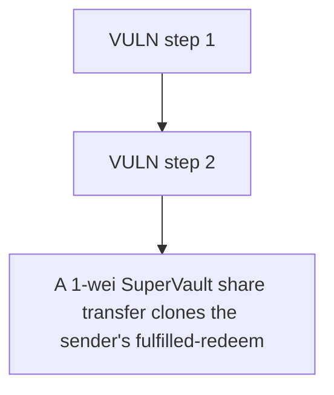

# Superform: A 1-wei SuperVault share transfer clones the sender's fulfilled-redeem state (maxWithdraw=

> **Vulnerability classes:** vuln/theft
>
> **Reproduction:** a faithful minimal reproduction of the vulnerable finding — the vulnerable function is reproduced **verbatim** (marked `@>`) with faithful minimal doubles; local deploy, no fork.

<!-- source-auditvault: https://github.com/Auditware/AuditVault/blob/main/findings/63075-malicious-actor-can-overwrite-others-user-state-via-1-wei-va.md -->

## Root cause

A 1-wei SuperVault share transfer clones the sender's fulfilled-redeem state (maxWithdraw=100) onto the recipient via _update, letting the attacker double-withdraw and drain 100 STOLEN-ASSET of another user's escrowed funds to the attacker EOA (escrow drained 200->0; victim's 100 claim left unbacked).

```solidity

// ─────────────────────────────────────────────────────────────────────────────
// VULNERABLE SuperVault: the ERC20 share token. `_update` is VERBATIM from the
// pre-fix audited source — it copies the sender's ENTIRE SuperVaultState onto
// the recipient on every real-user share transfer.
// ─────────────────────────────────────────────────────────────────────────────
```

## Why it's exploitable here

A 1-wei SuperVault share transfer clones the sender's fulfilled-redeem state (maxWithdraw=100) onto the recipient via _update, letting the attacker double-withdraw and drain 100 STOLEN-ASSET of another user's escrowed funds to the attacker EOA (escrow drained 200->0; victim's 100 claim left unbacked).

## Attack path



## Marked-line walkthrough (Playground)

The EVM Playground pins each step to the exact executed source line in `0xbd4fd5a3ce…`:

1. **L227** — VULN step 1: VULN: overwrites recipient's whole SuperVaultState (clones maxWithdraw) on any share transfer
2. **L229** — VULN step 2: VULN: overwrites recipient's whole SuperVaultState (clones maxWithdraw) on any share transfer

## PoC

Registry (Foundry, local deploy — verbatim vulnerable source + harm-asserting test + negative control):

```bash
cd 63075-malicious-actor-can-overwrite-others-user-state-via-1-wei-va_exp
forge test -vvv
```

The browser Playground replays the same synthetic opcode-for-opcode and measures the harm: **A 1-wei SuperVault share transfer clones the sender's fulfilled-redeem state (maxWithdraw=100) onto the recipient via _update, letting the a**. Both gates are green (registry `forge test` PASS + Playground `_verify-poc` **VERDICT: PASS**).
