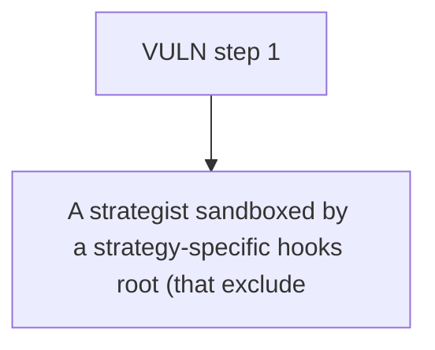

# Superform: A strategist sandboxed by a strategy-specific hooks root (that excludes the transferErc20 

> **Vulnerability classes:** vuln/theft
>
> **Reproduction:** a faithful minimal reproduction of the vulnerable finding — the vulnerable function is reproduced **verbatim** (marked `@>`) with faithful minimal doubles; local deploy, no fork.

<!-- source-auditvault: https://github.com/Auditware/AuditVault/blob/main/findings/63076-strategisthooksroot-permissions-may-be-circumvented-by-any-s.md -->

## Root cause

A strategist sandboxed by a strategy-specific hooks root (that excludes the transferErc20 hook) escapes the sandbox by supplying a valid GLOBAL Merkle proof + empty strategy proof; validateHook returns true before enforcing the strategy root, so the globally-permitted transferErc20 hook executes and drains 1000 STOLEN-USDC from the vault to the attacker.

```solidity
        // First try to verify against the global root if provided
        if (lengthGlobalProof > 0 && !globalHooksVetoed) {
            // Only validate against global root if it exists
            if (_globalHooksRoot != bytes32(0) && MerkleProof.verify(globalProof, _globalHooksRoot, leaf)) { // @> global proof short-circuits to `true` BEFORE any strategy-root enforcement — a sandboxed strategist escapes
                return true;
            }
```

## Why it's exploitable here

A strategist sandboxed by a strategy-specific hooks root (that excludes the transferErc20 hook) escapes the sandbox by supplying a valid GLOBAL Merkle proof + empty strategy proof; validateHook returns true before enforcing the strategy root, so the globally-permitted transferErc20 hook executes and drains 1000 STOLEN-USDC from the vault to the attacker.

## Attack path



## Marked-line walkthrough (Playground)

The EVM Playground pins each step to the exact executed source line in `0x671d353a77…`:

1. **L183** — VULN step 1: global proof short-circuits to `true` BEFORE any strategy-root enforcement — a sandboxed strategist escapes

## PoC

Registry (Foundry, local deploy — verbatim vulnerable source + harm-asserting test + negative control):

```bash
cd 63076-strategisthooksroot-permissions-may-be-circumvented-by-any-s_exp
forge test -vvv
```

The browser Playground replays the same synthetic opcode-for-opcode and measures the harm: **A strategist sandboxed by a strategy-specific hooks root (that excludes the transferErc20 hook) escapes the sandbox by supplying a valid GLO**. Both gates are green (registry `forge test` PASS + Playground `_verify-poc` **VERDICT: PASS**).
