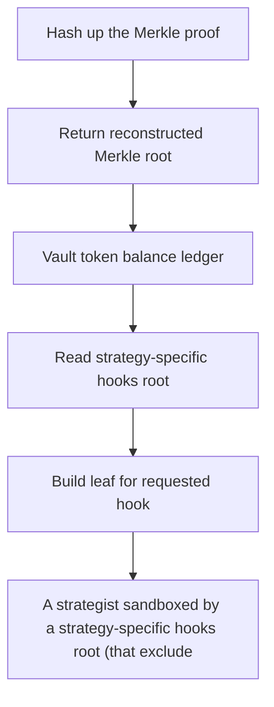

# Superform: A strategist sandboxed by a strategy-specific hooks root (that excludes the transferErc20 

> **Vulnerability classes:** vuln/theft
>
> **Reproduction:** a faithful minimal reproduction of the vulnerable finding — the vulnerable function is reproduced **verbatim** (marked `@>`) with faithful minimal doubles; local deploy, no fork.

<!-- source-auditvault: https://github.com/Auditware/AuditVault/blob/main/findings/63076-strategisthooksroot-permissions-may-be-circumvented-by-any-s.md -->

## Root cause

A strategist sandboxed by a strategy-specific hooks root (that excludes the transferErc20 hook) escapes the sandbox by supplying a valid GLOBAL Merkle proof + empty strategy proof; validateHook returns true before enforcing the strategy root, so the globally-permitted transferErc20 hook executes and drains 1000 STOLEN-USDC from the vault to the attacker.

```solidity
        // First try to verify against the global root if provided
        if (lengthGlobalProof > 0 && !globalHooksVetoed) {
            // Only validate against global root if it exists
            if (_globalHooksRoot != bytes32(0) && MerkleProof.verify(globalProof, _globalHooksRoot, leaf)) { // @> global proof short-circuits to `true` BEFORE any strategy-root enforcement — a sandboxed strategist escapes
                return true;
            }
```

## Why it's exploitable here

A strategist sandboxed by a strategy-specific hooks root (that excludes the transferErc20 hook) escapes the sandbox by supplying a valid GLOBAL Merkle proof + empty strategy proof; validateHook returns true before enforcing the strategy root, so the globally-permitted transferErc20 hook executes and drains 1000 STOLEN-USDC from the vault to the attacker.

## Attack path



## Marked-line walkthrough (Playground)

The EVM Playground pins each step to the exact executed source line in `0x671d353a77…`:

1. **L38** — Hash up the Merkle proof: Setup: loops over `proof`, hashing pairwise to rebuild a Merkle root up from the leaf.
2. **L41** — Return reconstructed Merkle root: Setup: returns the computed root so `MerkleProof.verify` can compare it against a stored root.
3. **L63** — Vault token balance ledger: Setup: `balanceOf` tracks the USDC the sandboxed strategist will try to drain from the vault.
4. **L136** — Read strategy-specific hooks root: Reads the per-`strategy` hooks root that is meant to sandbox this strategist to a limited hook set.
5. **L161** — Build leaf for requested hook: Builds the Merkle `leaf` for the hook the strategist wants to run, e.g. the fund-moving `transferErc20`.
6. **L183** — Global proof short-circuits check: Root cause: a valid GLOBAL-root proof returns true here before the strategy-specific root is ever enforced, escaping the sandbox.
7. **L184** — Grant hook via global branch: `return true` from the global branch permits `transferErc20`, letting the sandboxed strategist drain 1000 USDC.

## PoC

Registry (Foundry, local deploy — verbatim vulnerable source + harm-asserting test + negative control):

```bash
cd 63076-strategisthooksroot-permissions-may-be-circumvented-by-any-s_exp
forge test -vvv
```

The browser Playground replays the same synthetic opcode-for-opcode and measures the harm: **A strategist sandboxed by a strategy-specific hooks root (that excludes the transferErc20 hook) escapes the sandbox by supplying a valid GLO**. Both gates are green (registry `forge test` PASS + Playground `_verify-poc` **VERDICT: PASS**).
