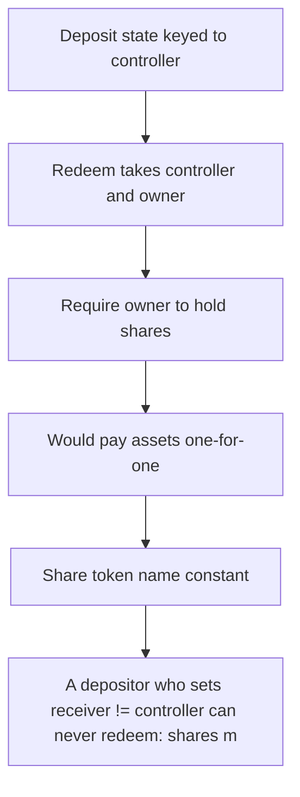

# Superform: A depositor who sets receiver != controller can never redeem: shares mint to the receiver 

> **Vulnerability classes:** vuln/locked-funds · vuln/unfair-mint
>
> **Reproduction:** a faithful minimal reproduction of the vulnerable finding — the vulnerable function is reproduced **verbatim** (marked `@>`) with faithful minimal doubles; local deploy, no fork.

<!-- source-auditvault: https://github.com/Auditware/AuditVault/blob/main/findings/63077-controller-and-receiver-cannot-redeem-shares-after-depositin.md -->

## Root cause

A depositor who sets receiver != controller can never redeem: shares mint to the receiver while the redeem cost-basis state is recorded under the controller, so receiver-redeem reverts INSUFFICIENT_SHARES (empty state) and controller-redeem reverts (no shares) — 100 USDC is permanently locked in the vault.

```solidity

        // ── VERBATIM audited call-site: cost-basis state credited to the
        //    controller (msg.sender), shares minted to `receiver`. ──────────────
        strategy.handleOperation(msg.sender, receiver, assets, shares, ISuperVaultStrategy.Operation.Deposit); // @> state keyed to controller(msg.sender), not the share receiver
        _mint(receiver, shares);
    }
```

## Why it's exploitable here

A depositor who sets receiver != controller can never redeem: shares mint to the receiver while the redeem cost-basis state is recorded under the controller, so receiver-redeem reverts INSUFFICIENT_SHARES (empty state) and controller-redeem reverts (no shares) — 100 USDC is permanently locked in the vault.

## Attack path



## Marked-line walkthrough (Playground)

The EVM Playground pins each step to the exact executed source line in `0xce01759b82…`:

1. **L225** — Deposit state keyed to controller: Root cause: deposit records redeem state under `msg.sender` (controller) while shares mint to a different `receiver`, splitting the two.
2. **L231** — Redeem takes controller and owner: `redeem` accepts `controller` and `owner` separately, but the deposit recorded state under only one of them.
3. **L232** — Require owner to hold shares: Reverts `NoSharesToRedeem` unless `owner` holds the shares — the controller-redeem path dies here.
4. **L238** — Would pay assets one-for-one: Sets `assets = shares` for a 1:1 payout — but execution never reaches it once redeem reverts.
5. **L249** — Share token name constant: Setup: the vault share token's constant `name`.
6. **L253** — Share balance ledger: Setup: per-holder share `balanceOf` — empty for the controller, so its redeem reverts.
7. **L256** — Immutable strategy pointer: Setup: immutable `strategy` holding the deposit/redeem state that was keyed to the wrong address.

## PoC

Registry (Foundry, local deploy — verbatim vulnerable source + harm-asserting test + negative control):

```bash
cd 63077-controller-and-receiver-cannot-redeem-shares-after-depositin_exp
forge test -vvv
```

The browser Playground replays the same synthetic opcode-for-opcode and measures the harm: **A depositor who sets receiver != controller can never redeem: shares mint to the receiver while the redeem cost-basis state is recorded unde**. Both gates are green (registry `forge test` PASS + Playground `_verify-poc` **VERDICT: PASS**).
