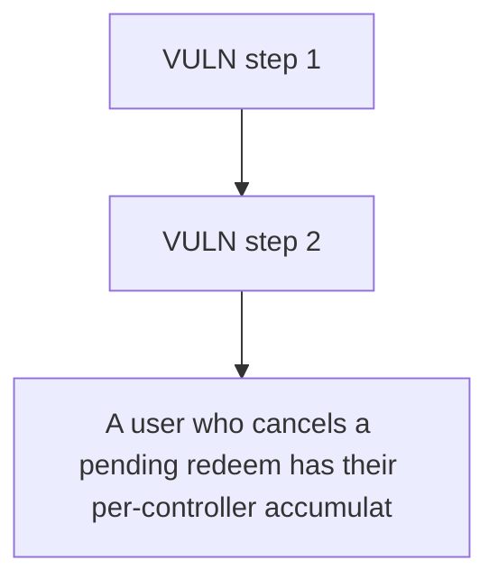

# Superform: A user who cancels a pending redeem has their per-controller accumulatorShares/accumulator

> **Vulnerability classes:** vuln/locked-funds
>
> **Reproduction:** a faithful minimal reproduction of the vulnerable finding — the vulnerable function is reproduced **verbatim** (marked `@>`) with faithful minimal doubles; local deploy, no fork.

<!-- source-auditvault: https://github.com/Auditware/AuditVault/blob/main/findings/63081-cancelled-redeem-requests-make-shares-permanently-unredeemab.md -->

## Root cause

A user who cancels a pending redeem has their per-controller accumulatorShares/accumulatorCostBasis wiped by `delete superVaultState[controller]`, so every subsequent fulfillRedeem reverts INSUFFICIENT_SHARES() and their 100 shares' full asset backing (100e18) is frozen in the strategy forever.

```solidity
        uint256 pendingShares = state.pendingRedeemRequest;
        if (pendingShares == 0) revert REQUEST_NOT_FOUND();
        delete superVaultState[controller]; // @> BUG: wipes accumulatorShares/accumulatorCostBasis, not just the pending request
        emit RedeemRequestCanceled(controller, pendingShares);
    }

```

## Why it's exploitable here

A user who cancels a pending redeem has their per-controller accumulatorShares/accumulatorCostBasis wiped by `delete superVaultState[controller]`, so every subsequent fulfillRedeem reverts INSUFFICIENT_SHARES() and their 100 shares' full asset backing (100e18) is frozen in the strategy forever.

## Attack path



## Marked-line walkthrough (Playground)

The EVM Playground pins each step to the exact executed source line in `0x671d353a77…`:

1. **L142** — VULN step 1: BUG: wipes accumulatorShares/accumulatorCostBasis, not just the pending request
2. **L144** — VULN step 2: BUG: wipes accumulatorShares/accumulatorCostBasis, not just the pending request

## PoC

Registry (Foundry, local deploy — verbatim vulnerable source + harm-asserting test + negative control):

```bash
cd 63081-cancelled-redeem-requests-make-shares-permanently-unredeemab_exp
forge test -vvv
```

The browser Playground replays the same synthetic opcode-for-opcode and measures the harm: **A user who cancels a pending redeem has their per-controller accumulatorShares/accumulatorCostBasis wiped by `delete superVaultState[control**. Both gates are green (registry `forge test` PASS + Playground `_verify-poc` **VERDICT: PASS**).
