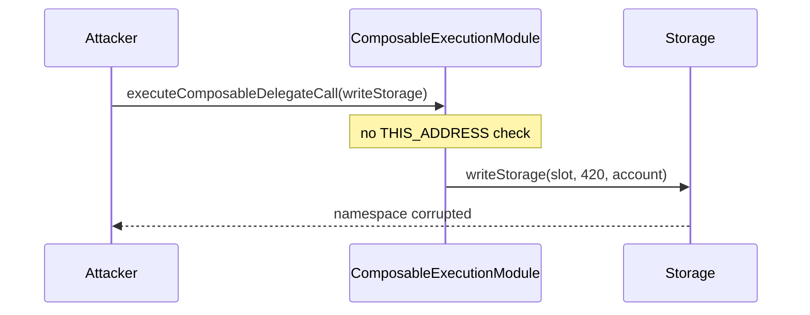

# Biconomy Composability — [C-01] Missing DelegateCall check

> **Vulnerability classes:** vuln/access-control/missing-guard · ownership-takeover · missing-modifier

> **Reproduction:** a self-contained Foundry PoC that compiles & runs in an
> isolated project with **only `forge-std`** — no fork, no RPC, no `anvil_state`.
> Full trace: [output.txt](output.txt). PoC:
> [test/63148-c-01-missing-delegatecall-check-pashov-audit-group-none-bico_exp.sol](test/63148-c-01-missing-delegatecall-check-pashov-audit-group-none-bico_exp.sol).

<!-- non-defihacklabs -->
<!-- source-auditvault: https://github.com/Auditware/AuditVault/blob/main/findings/63148-c-01-missing-delegatecall-check-pashov-audit-group-none-bico.md -->
<!-- date: 2025-03 -->

**AuditVault taxonomy:** `severity/high` · `sector/account` · `sector/staking` · `platform/pashov` · `missing-modifier` · `ownership-takeover` · `cross-protocol` · `access-roles` · `blast-radius/cross-protocol`

---

## Key info

| | |
|---|---|
| **Impact** | **HIGH** — direct call runs unrestricted composed executions / storage writes as the module |
| **Protocol** | Biconomy Composability — `ComposableExecutionModule` |
| **Vulnerable code** | `executeComposableDelegateCall` lacks `require(THIS_ADDRESS != address(this))` |
| **Bug class** | Missing delegatecall-only guard on module entrypoint |
| **Finding** | Pashov Audit Group · BiconomyComposability 2025-03-22 · #63148 |
| **Report** | [Pashov review](https://github.com/pashov/audits/blob/master/team/md/BiconomyComposability-security-review_2025-03-22.md) |
| **Source** | [AuditVault](https://github.com/Auditware/AuditVault/blob/main/findings/63148-c-01-missing-delegatecall-check-pashov-audit-group-none-bico.md) |
| **Status** | Audit finding. Reproduced as a standalone local PoC. |
| **Compiler** | `^0.8.24` (PoC) |

---

## TL;DR

1. `executeComposableDelegateCall` is meant only via smart-account `CALLTYPE_DELEGATECALL`.
2. There is no check that `address(this)` differs from the module’s immutable deployment address.
3. Anyone can call the function directly on the module and run composed calls (e.g. `writeStorage`).
4. Shared storage for account namespaces can be corrupted; combined with executor paths this enables unrestricted account operations.

---

## The vulnerable code

```solidity
function executeComposableDelegateCall(ComposableExecution[] calldata executions) external {
    // FIX: require(THIS_ADDRESS != address(this), "NotAllowed");
    _executeComposable(executions); // @> VULN: missing delegatecall-only guard
}
```

---

## Root cause

The function relies on a documentation convention (“expected to be called via delegatecall”) instead of an on-chain identity check. Direct `CALL` keeps `address(this) == module`, so module-privileged composed logic runs for arbitrary callers.

## Preconditions

- Module deployed and (in the full system) installed on target smart accounts / sharing Storage.
- Attacker can craft `ComposableExecution[]` payloads (e.g. `writeStorage`).

## Attack walkthrough

1. Read target storage slot under account namespace (initially 0).
2. Build a composed execution targeting `Storage.writeStorage(slot, 420, account)`.
3. Call `executeComposableDelegateCall` **directly** on the module (no account, no delegatecall).
4. Slot is overwritten to 420 under the module’s write path.

## Diagrams



## Impact

Unauthorized storage manipulation and, via `executeFromExecutor` paths in the full system, unrestricted operations on smart accounts that installed the module.

## Sources

- [AuditVault finding #63148](https://github.com/Auditware/AuditVault/blob/main/findings/63148-c-01-missing-delegatecall-check-pashov-audit-group-none-bico.md)
- [Pashov BiconomyComposability security review 2025-03-22](https://github.com/pashov/audits/blob/master/team/md/BiconomyComposability-security-review_2025-03-22.md)
- Reduced source: `ComposableExecutionModule.executeComposableDelegateCall` (Pashov report)
