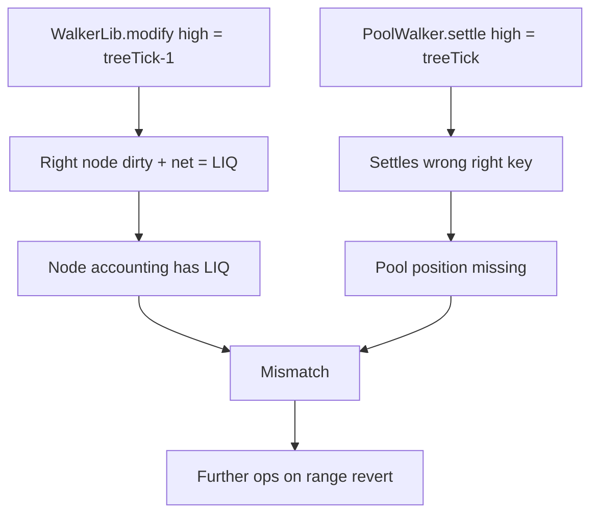

# Ammplify — H-3: Pool liquidity vs node liquidity mismatch from wrong `PoolWalker.settle` route

> **Vulnerability classes:** vuln/logic/fee-calculation · wrong-state · fee-accounting

> **Reproduction:** a self-contained Foundry PoC that compiles & runs in an
> isolated project with **only `forge-std`** — no fork, no RPC, no `anvil_state`.
> Full trace: [output.txt](output.txt). PoC:
> [test/63169-h-3-mismatch-in-actual-pools-liquidity-and-pool-nodes-liquid_exp.sol](test/63169-h-3-mismatch-in-actual-pools-liquidity-and-pool-nodes-liquid_exp.sol).

<!-- non-defihacklabs -->
<!-- source-auditvault: https://github.com/Auditware/AuditVault/blob/main/findings/63169-h-3-mismatch-in-actual-pools-liquidity-and-pool-nodes-liquid.md -->
<!-- date: 2025-09 -->

**AuditVault taxonomy:** `severity/high` · `sector/dex` · `platform/sherlock` · `fee-calculation` · `wrong-state` · `variant` · `fee-accounting` · `timestamp-dependence`

---

## Key info

| | |
|---|---|
| **Impact** | **HIGH** — node accounting diverges from actual pool positions; maker/taker ops on affected ranges revert |
| **Protocol** | Ammplify (itos-finance) |
| **Vulnerable code** | `PoolWalker.settle` uses `treeTick(highTick)` instead of `treeTick(highTick) - 1` |
| **Bug class** | Off-by-one tree index → wrong settlement route |
| **Finding** | Sherlock 2025-09-ammplify · #63169 / issue 208 · reporter **panprog** (+ many) |
| **Report** | [sherlock-audit/2025-09-ammplify-judging](https://github.com/sherlock-audit/2025-09-ammplify-judging) |
| **Source** | [AuditVault](https://github.com/Auditware/AuditVault/blob/main/findings/63169-h-3-mismatch-in-actual-pools-liquidity-and-pool-nodes-liquid.md) |
| **Status** | Audit finding — fixed in itos-finance/Ammplify PR #14. Reproduced as a standalone local PoC. |
| **Compiler** | `^0.8.24` (PoC) |

---

## TL;DR

1. `WalkerLib.modify` marks nodes using high index `treeTick(highTick) - 1`.
2. `PoolWalker.settle` walks high index `treeTick(highTick)` (one higher).
3. Settlement skips the correct right node → pool never mints that range’s position while node net records liquidity.
4. Later maker/taker/remove on the affected range fail because the pool position is missing.

---

## The vulnerable code

```solidity
function settle(PoolInfo memory pInfo, int24 lowTick, int24 highTick, Data memory data) internal {
    uint24 low = pInfo.treeTick(lowTick);
    uint24 high = pInfo.treeTick(highTick); // @> VULN: missing -1 vs WalkerLib.modify
    // FIX: uint24 high = pInfo.treeTick(highTick) - 1;
    Route memory route = RouteImpl.make(pInfo.treeWidth, low, high);
    // ...
}
```

---

## Root cause

Asymmetric exclusive-high indexing between modify and settle. Routes diverge on the right key, so settlement can miss the dirty right leaf that modify updated.

## Preconditions

- Maker position whose `highTick` maps to a tree index where `treeTick(high)` and `treeTick(high)-1` select different right keys (common on non-aligned ranges).

## Attack walkthrough

1. Maker creates asset on `[-150, 150]` with spacing 10.
2. `WalkerLib.modify` dirties right key `treeTick(150)-1`.
3. `PoolWalker.settle` settles right key `treeTick(150)` instead — correct right never minted.
4. `node.net == LIQ` but `pool.getLiq(rightRange) == 0`.
5. Subsequent `newMaker` / `newTaker` / `removeMaker` on the affected node reverts.

## Diagrams



## Impact

Inconsistent fee/liquidity accounting; residual balances in facets; failed maker/taker/remove operations for ranges touching the mismatched node. Critical for any protocol path that trusts node state to match the underlying pool.

## Sources

- [AuditVault finding #63169](https://github.com/Auditware/AuditVault/blob/main/findings/63169-h-3-mismatch-in-actual-pools-liquidity-and-pool-nodes-liquid.md)
- [Sherlock 2025-09-ammplify judging #208](https://github.com/sherlock-audit/2025-09-ammplify-judging/issues/208)
- Reduced source: sherlock-audit/2025-09-ammplify — `WalkerLib.modify` / `PoolWalker.settle` (fix: itos-finance/Ammplify PR #14)
