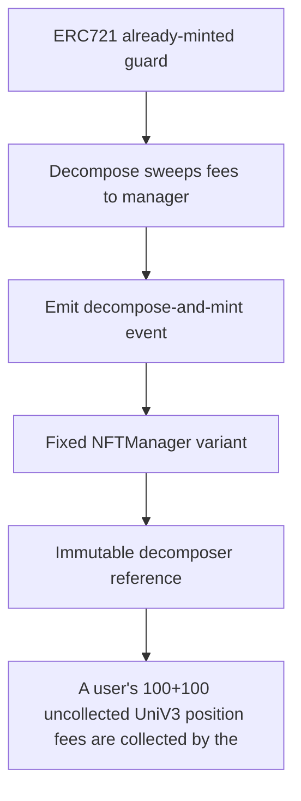

# Ammplify: A user's 100+100 uncollected UniV3 position fees are collected by the decomposer and swept

> **Vulnerability classes:** vuln/locked-funds · vuln/unfair-mint · vuln/reward-accounting
>
> **Reproduction:** a faithful minimal reproduction of the vulnerable finding — the vulnerable function is reproduced **verbatim** (marked `@>`) with faithful minimal doubles; local deploy, no fork.

<!-- source-auditvault: https://github.com/Auditware/AuditVault/blob/main/findings/63170-h-4-uncollected-fees-from-users-nft-position-are-stuck-in-nf.md -->

## Root cause

A user's 100+100 uncollected UniV3 position fees are collected by the decomposer and swept to caller==NFTManager, but decomposeAndMint never forwards them, so the user permanently loses those fees (stranded in NFTManager).

```solidity
        _currentTokenRequester = msg.sender;

        // Decompose the Uniswap V3 position
        assetId = DECOMPOSER.decompose(positionId, isCompounding, minSqrtPriceX96, maxSqrtPriceX96, rftData);

        // Clear the token requester context
```

## Why it's exploitable here

A user's 100+100 uncollected UniV3 position fees are collected by the decomposer and swept to caller==NFTManager, but decomposeAndMint never forwards them, so the user permanently loses those fees (stranded in NFTManager).

## Attack path



## Marked-line walkthrough (Playground)

The EVM Playground pins each step to the exact executed source line in `0xbd4fd5a3ce…`:

1. **L95** — ERC721 already-minted guard: Setup: reverts if `tokenId` was already minted before wrapping the position into a new NFT.
2. **L201** — Decompose sweeps fees to manager: Root cause: `decompose` sweeps the position's uncollected fees to this NFTManager, but `decomposeAndMint` never forwards them to the user.
3. **L214** — Emit decompose-and-mint event: Emits the decompose/mint event — with no accompanying fee transfer, so the collected fees stay stranded.
4. **L222** — Fixed NFTManager variant: Setup: `NFTManagerFixed`, the patched contract that does forward the collected fees to the user.
5. **L223** — Immutable decomposer reference: Setup: immutable `DECOMPOSER` used to unwind the UniV3 position.
6. **L226** — Internal supply counter: Setup: `_currentSupply` tracks the number of minted asset NFTs.
7. **L236** — Constructor stores decomposer: Setup: constructor records the `DECOMPOSER` address.

## PoC

Registry (Foundry, local deploy — verbatim vulnerable source + harm-asserting test + negative control):

```bash
cd 63170-h-4-uncollected-fees-from-users-nft-position-are-stuck-in-nf_exp
forge test -vvv
```

The browser Playground replays the same synthetic opcode-for-opcode and measures the harm: **A user's 100+100 uncollected UniV3 position fees are collected by the decomposer and swept to caller==NFTManager, but decomposeAndMint never**. Both gates are green (registry `forge test` PASS + Playground `_verify-poc` **VERDICT: PASS**).
