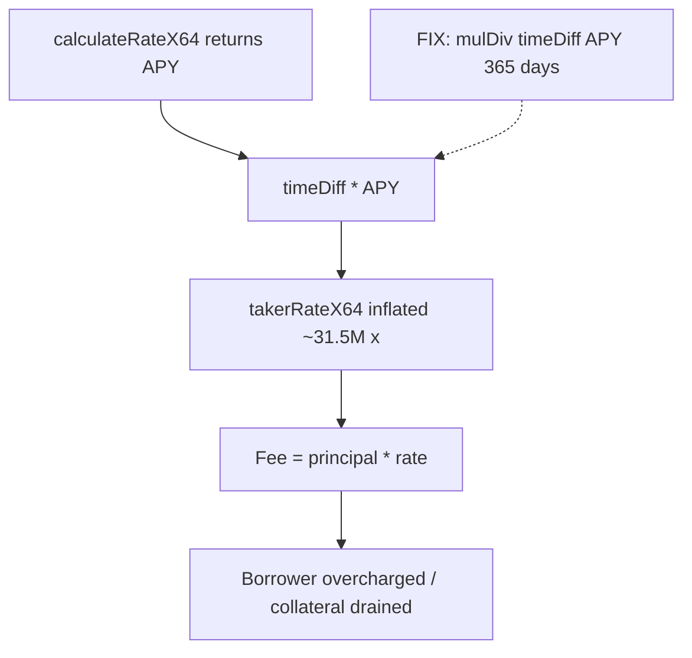

# Ammplify — H-5: Borrow fee uses APY as per-second rate (extreme overcharge)

> **Vulnerability classes:** fee-calculation · wrong-state · fee-accounting · timestamp-dependence

> **Reproduction:** a self-contained Foundry PoC that compiles & runs in an
> isolated project with **only `forge-std`** — no fork, no RPC, no `anvil_state`.
> Full trace: [output.txt](output.txt). PoC:
> [test/63171-h-5-borrow-fee-uses-apy-as-per-second-rate-causing-extreme-o_exp.sol](test/63171-h-5-borrow-fee-uses-apy-as-per-second-rate-causing-extreme-o_exp.sol).

<!-- non-defihacklabs -->
<!-- source-auditvault: https://github.com/Auditware/AuditVault/blob/main/findings/63171-h-5-borrow-fee-uses-apy-as-per-second-rate-causing-extreme-o.md -->
<!-- date: 2025-09 -->

**AuditVault taxonomy:** `severity/high` · `sector/dex` · `sector/lending` · `platform/sherlock` · `fee-calculation` · `wrong-state` · `fee-accounting` · `integer-bounds` · `timestamp-dependence`

---

## Key info

| | |
|---|---|
| **Impact** | **HIGH** — borrowers overcharged ~31,536,000× (APY treated as per-second) |
| **Protocol** | Ammplify (itos-finance) |
| **Vulnerable code** | `FeeWalker.chargeTrueFeeRate` multiplies annual rate by `timeDiff` without `/ 365 days` |
| **Bug class** | Unit mismatch (annual rate × seconds) |
| **Finding** | Sherlock 2025-09-ammplify · #63171 / issue 379 · reporters ARMoh, SOPROBRO, blockace |
| **Report** | [sherlock-audit/2025-09-ammplify-judging](https://github.com/sherlock-audit/2025-09-ammplify-judging) |
| **Source** | [AuditVault](https://github.com/Auditware/AuditVault/blob/main/findings/63171-h-5-borrow-fee-uses-apy-as-per-second-rate-causing-extreme-o.md) |
| **Status** | Audit finding — fixed in itos-finance/Ammplify PR #40. Reproduced as a standalone local PoC. |
| **Compiler** | `^0.8.24` (PoC) |

---

## TL;DR

1. Smooth rate curve returns an **annual** rate (APY) in Q64.64.
2. `chargeTrueFeeRate` does `takerRateX64 = timeDiff * calculateRateX64(util)` with no `/ 365 days`.
3. Even 1 second of borrow accrues ~22% of principal at the PoC rate; intended fee is dust.
4. Closing a taker position drains collateral via catastrophic fees.

---

## The vulnerable code

```solidity
uint256 timeDiff = uint128(block.timestamp) - data.timestamp;
uint256 takerRateX64 = timeDiff * data.fees.rateConfig.calculateRateX64(
    uint64((totalTLiq << 64) / totalMLiq)
); // @> VULN: APY used as per-second — missing / 365 days
// FIX: FullMath.mulDiv(timeDiff, calculateRateX64(...), 365 days)
```

---

## Root cause

Annual rate applied as if it were already a per-second rate. Library docs (`SmoothRateCurveLib`) define SPR = APR / 31_536_000; the walker never applies that conversion.

## Preconditions

- Non-zero taker liquidity / borrow so fees are charged.
- Any positive elapsed time between open and charge (even 1 second).

## Attack walkthrough

1. Open borrow with 50e18 principal at ~50% util.
2. `chargeTrueFeeRate` multiplies APY by elapsed seconds.
3. Fee = principal × inflated rate ≫ annualized intent.
4. Borrower pays orders-of-magnitude more than designed.

## Diagrams



## Impact

Catastrophic borrower overcharging for any non-zero hold time; potential total loss of collateral on brief borrows.

## Sources

- [AuditVault finding #63171](https://github.com/Auditware/AuditVault/blob/main/findings/63171-h-5-borrow-fee-uses-apy-as-per-second-rate-causing-extreme-o.md)
- [Sherlock 2025-09-ammplify judging #379](https://github.com/sherlock-audit/2025-09-ammplify-judging/issues/379)
- Reduced source: sherlock-audit/2025-09-ammplify — `src/walkers/Fee.sol` `chargeTrueFeeRate` (fix: itos-finance/Ammplify PR #40)
