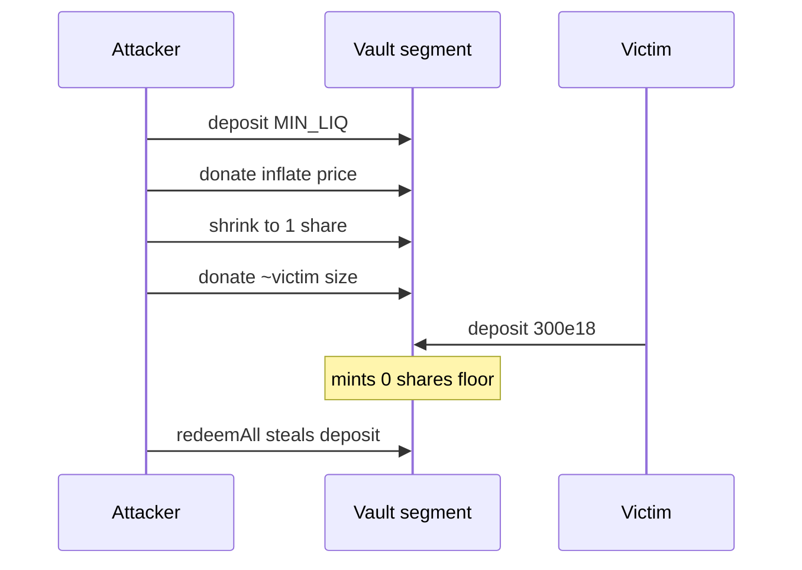

# Ammplify — H-6: First-deposit share inflation steals compounded maker deposits

> **Vulnerability classes:** rounding-direction · frontrun · first-deposit · integer-bounds

> **Reproduction:** self-contained Foundry PoC with **only `forge-std`**.
> Full trace: [output.txt](output.txt). PoC:
> [test/63172-h-6-user-can-lose-all-funds-when-creating-or-increasing-comp_exp.sol](test/63172-h-6-user-can-lose-all-funds-when-creating-or-increasing-comp_exp.sol).

<!-- non-defihacklabs -->
<!-- source-auditvault: https://github.com/Auditware/AuditVault/blob/main/findings/63172-h-6-user-can-lose-all-funds-when-creating-or-increasing-comp.md -->
<!-- date: 2025-09 -->

**AuditVault taxonomy:** `severity/high` · `sector/dex` · `sector/lending` · `platform/sherlock` · `rounding-direction` · `frontrun` · `first-deposit`

---

## Key info

| | |
|---|---|
| **Impact** | **HIGH** — victim mints 0 shares; attacker redeems their full deposit |
| **Protocol** | Ammplify (itos-finance) |
| **Vulnerable code** | Compound share mint rounds down; only min **liquidity** enforced, not min **shares** |
| **Bug class** | ERC-4626-style first depositor inflation on per-segment vaults |
| **Finding** | Sherlock 2025-09-ammplify · #63172 / issue 417 · panprog (+ others) |
| **Report** | [sherlock-audit/2025-09-ammplify-judging](https://github.com/sherlock-audit/2025-09-ammplify-judging) |
| **Status** | Audit finding. Reproduced as a standalone local PoC. |
| **Compiler** | `^0.8.24` (PoC) |

---

## TL;DR

1. Each compounded segment acts as a vault with `shares = liq * totalShares / totalLiq` (floor).
2. Attacker seeds min liquidity, donates, shrinks to 1 share, donates again.
3. Victim’s large deposit mints **0 shares**; Uniswap/vault liq still increases.
4. Attacker redeems the sole share and steals the victim’s assets.

---

## The vulnerable code

```solidity
shares = (liq * totalShares) / totalLiq; // @> VULN: rounds down after inflation
// min check only on target liquidity, not shares
```

---

## Root cause

Floor division on share mint plus donation-inflatable total liquidity. Minimum liquidity is not a minimum-share guard.

## Preconditions

- Empty (or attacker-controlled) segment the victim is about to enter.

## Attack walkthrough

1. Attacker deposits `MIN_LIQ`, donates, shrinks to 1 share.
2. Second donation ≈ victim size → 1 share worth ≫ deposit.
3. Victim deposits 300e18 → 0 shares.
4. Attacker `redeemAll` takes vault including victim funds.

## Diagrams



## Impact

Full loss of victim deposit on any empty compounded segment (many segments → many attack surfaces).

## Sources

- [AuditVault finding #63172](https://github.com/Auditware/AuditVault/blob/main/findings/63172-h-6-user-can-lose-all-funds-when-creating-or-increasing-comp.md)
- [Sherlock judging #417](https://github.com/sherlock-audit/2025-09-ammplify-judging/issues/417)
- Reduced source: `src/walkers/Liq.sol` share mint; `src/facets/Maker.sol` min liq
