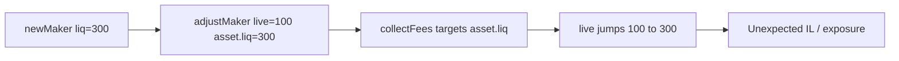

# Ammplify — H-7: `collectFees` re-targets original `asset.liq` after `adjustMaker`

> **Vulnerability classes:** decimal-mismatch · fee-theft · cross-contract-state-consistency

> **Reproduction:** self-contained Foundry PoC with **only `forge-std`**.
> Full trace: [output.txt](output.txt).

<!-- non-defihacklabs -->
<!-- source-auditvault: https://github.com/Auditware/AuditVault/blob/main/findings/63173-h-7-makercollectfees-re-targets-liquidity-to-original-amount.md -->
<!-- date: 2025-09 -->

**AuditVault taxonomy:** `severity/high` · `sector/dex` · `platform/sherlock` · `fee-theft` · `cross-contract-state-consistency`

---

## Key info

| | |
|---|---|
| **Impact** | **HIGH** — position size jumps on fee collection; IL / unexpected exposure |
| **Protocol** | Ammplify |
| **Vulnerable code** | `Maker.collectFees` targets `asset.liq` never updated by `adjustMaker` |
| **Finding** | #63173 / issue 421 · panprog (+ many) |
| **Status** | Fixed in itos-finance/Ammplify PR #31 |
| **Compiler** | `^0.8.24` |

---

## TL;DR

1. `newMaker` stores `asset.liq = 300e18`.
2. `adjustMaker` sets live liq to `100e18` but leaves `asset.liq` unchanged.
3. `collectFees` re-targets to `asset.liq` → position snaps back to 300e18.
4. User who expected fee-only collection is re-exposed (or may brick if diamond underfunded).

---

## The vulnerable code

```solidity
// We collect simply by targeting the original liq balance.
uint128 target = a.liq; // @> VULN: original amount; adjustMaker never updated asset.liq
// FIX: a.liq = targetLiq in adjustMaker; collect uses live target
```

## Diagrams



## Sources

- [AuditVault #63173](https://github.com/Auditware/AuditVault/blob/main/findings/63173-h-7-makercollectfees-re-targets-liquidity-to-original-amount.md)
- [Sherlock #421](https://github.com/sherlock-audit/2025-09-ammplify-judging/issues/421)
- Source: `src/facets/Maker.sol` collectFees / adjustMaker (fix PR #31)
