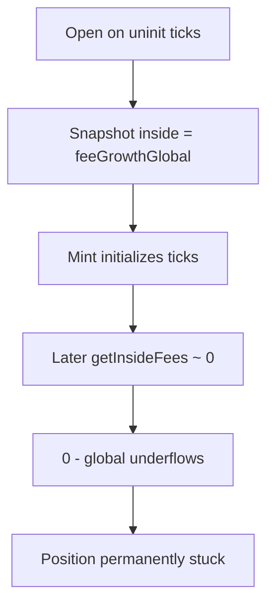

# Ammplify — H-8: Uninitialized Uniswap ticks inflate `getInsideFees` (funds stuck)

> **Vulnerability classes:** fee-calculation · locked-funds · data/uninitialized

> **Reproduction:** self-contained Foundry PoC with **only `forge-std`**.
> Full trace: [output.txt](output.txt).

<!-- non-defihacklabs -->
<!-- source-auditvault: https://github.com/Auditware/AuditVault/blob/main/findings/63174-h-8-incorrect-inside-fees-calculation-for-uninitialized-unis.md -->
<!-- date: 2025-09 -->

**AuditVault taxonomy:** `severity/high` · `sector/dex` · `platform/sherlock` · `fee-calculation` · `locked-funds` · `data/uninitialized`

---

## Key info

| | |
|---|---|
| **Impact** | **HIGH** — position permanently stuck (underflow); also enables fee inflation theft |
| **Protocol** | Ammplify |
| **Vulnerable code** | `PoolLib.getInsideFees` treats uninitialized tick outsides as 0 → inside = global |
| **Finding** | #63174 / issue 422 · panprog |
| **Status** | Fixed PR #32 |
| **Compiler** | `^0.8.24` |

---

## TL;DR

1. Open maker while ticks uninitialized and price inside range.
2. Snapshot stores `feeGrowthInside = feeGrowthGlobal` (inflated).
3. Settle initializes ticks; later `getInsideFees` returns ~0.
4. `compound` does `new - stored` → underflow; funds stuck forever.

---

## The vulnerable code

```solidity
feeGrowthInside0X128 = feeGrowthGlobal0X128 - lowerFeeGrowthOutside0X128 - upperFeeGrowthOutside0X128;
// @> VULN: uninitialized outside=0 → inside = global
// FIX: if tick not initialized, return 0
```

## Diagrams



## Sources

- [AuditVault #63174](https://github.com/Auditware/AuditVault/blob/main/findings/63174-h-8-incorrect-inside-fees-calculation-for-uninitialized-unis.md)
- [Sherlock #422](https://github.com/sherlock-audit/2025-09-ammplify-judging/issues/422)
- Source: `src/Pool.sol` getInsideFees (fix PR #32)
