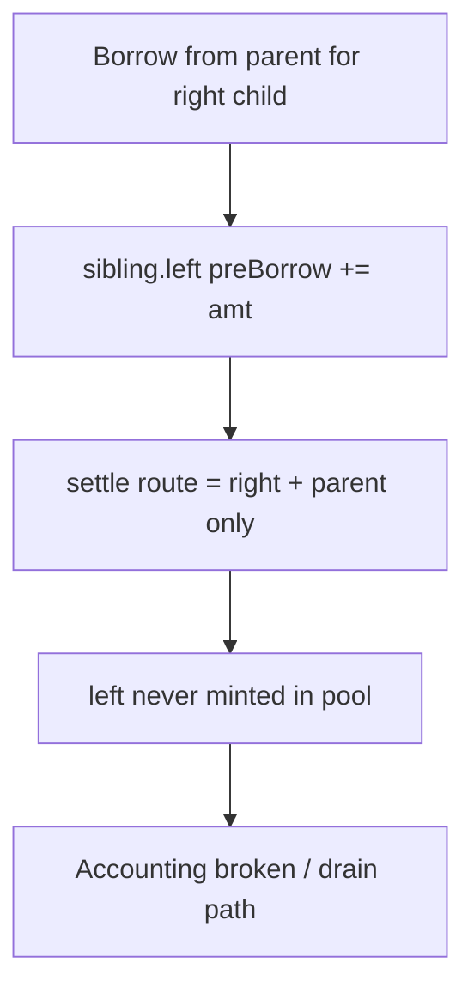

# Ammplify — H-9: Parent borrow marks sibling but settle skips sibling mint

> **Vulnerability classes:** decimal-mismatch · fee-theft · price-manipulation

> **Reproduction:** self-contained Foundry PoC with **only `forge-std`**.
> Full trace: [output.txt](output.txt).

<!-- non-defihacklabs -->
<!-- source-auditvault: https://github.com/Auditware/AuditVault/blob/main/findings/63175-h-9-liquidity-borrowed-from-or-repaid-to-parent-nodes-is-not.md -->
<!-- date: 2025-09 -->

**AuditVault taxonomy:** `severity/high` · `sector/dex` · `platform/sherlock` · `fee-theft` · `data-corruption/price-manipulation`

---

## Key info

| | |
|---|---|
| **Impact** | **HIGH** — pool vs node accounting diverge; enables draining protocol balances |
| **Protocol** | Ammplify |
| **Vulnerable code** | `solveLiq` sets `sibling.preBorrow` but settle route omits sibling |
| **Finding** | #63175 / issue 424 · anonymousjoe, blockace, panprog |
| **Compiler** | `^0.8.24` |

---

## TL;DR

1. Taker demand on a child forces borrow from parent.
2. Sibling also receives `preBorrow` (parent liq = both children).
3. Settle walks only the op route (child+parent), **not** sibling.
4. Uniswap never mints sibling liq → accounting lies; price games steal funds.

---

## The vulnerable code

```solidity
sibling.preBorrow += borrow; // @> VULN: sibling not on settle route
sibling.dirty = true;
// FIX: second settle pass over siblings / include both children in route
```

## Diagrams



## Sources

- [AuditVault #63175](https://github.com/Auditware/AuditVault/blob/main/findings/63175-h-9-liquidity-borrowed-from-or-repaid-to-parent-nodes-is-not.md)
- [Sherlock #424](https://github.com/sherlock-audit/2025-09-ammplify-judging/issues/424)
- Source: `src/walkers/Liq.sol` solveLiq
