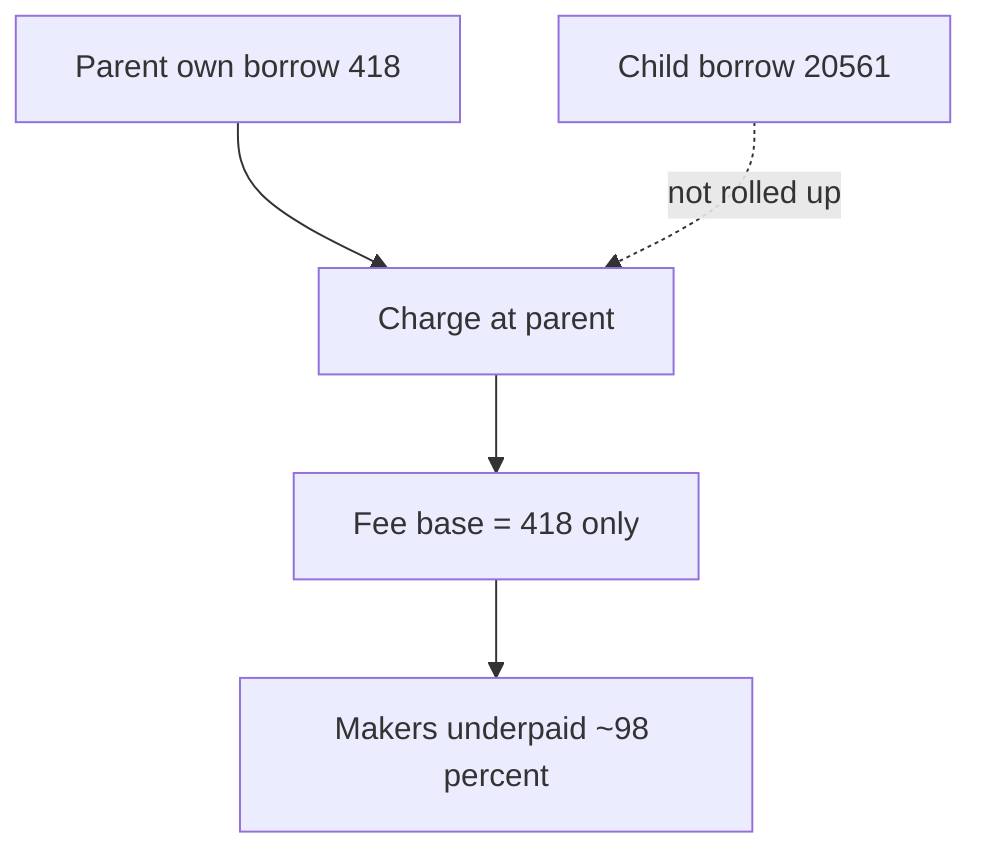

# Ammplify — H-10: `subtreeBorrowedX/Y` is node-only (makers underpaid)

> **Vulnerability classes:** fee-calculation · fee-theft

> **Reproduction:** self-contained Foundry PoC with **only `forge-std`**.
> Full trace: [output.txt](output.txt).

<!-- non-defihacklabs -->
<!-- source-auditvault: https://github.com/Auditware/AuditVault/blob/main/findings/63176-h-10-takers-can-pay-significantly-less-fees-with-makers-losi.md -->
<!-- date: 2025-09 -->

**AuditVault taxonomy:** `severity/high` · `sector/dex` · `platform/sherlock` · `fee-calculation` · `fee-theft`

---

## Key info

| | |
|---|---|
| **Impact** | **HIGH** — makers lose up to ~99% of taker fees when parent touched first |
| **Protocol** | Ammplify |
| **Vulnerable code** | Fee base uses `node.subtreeBorrowedX` without rolling up children |
| **Finding** | #63176 / issue 426 · panprog (+ others) |
| **Compiler** | `^0.8.24` |

---

## TL;DR

1. Child holds large `subtreeBorrowed`; parent holds small own borrow.
2. Fee charge on parent adds only `parent.subtreeBorrowedX` (node-only).
3. Child mass ignored → fees ~418 vs correct ~20979 in the demo numbers.
4. Takers underpay; makers lose the residual.

---

## The vulnerable code

```solidity
totalXBorrows += node.liq.subtreeBorrowedX; // @> VULN: not a true subtree sum
// FIX: ownBorrow + children.subtreeBorrow like subtreeTLiq
```

## Diagrams



## Sources

- [AuditVault #63176](https://github.com/Auditware/AuditVault/blob/main/findings/63176-h-10-takers-can-pay-significantly-less-fees-with-makers-losi.md)
- [Sherlock #426](https://github.com/sherlock-audit/2025-09-ammplify-judging/issues/426)
- Source: `src/walkers/Liq.sol` / Fee walker borrow base
