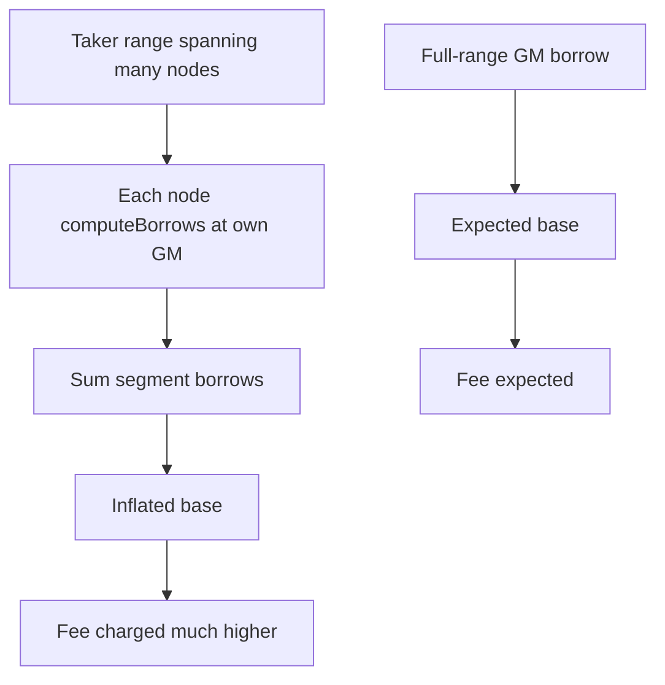

# Ammplify — H-11: Segment-split geometric-mean borrow overstates taker fees

> **Vulnerability classes:** fee-calculation · wrong-state

> **Reproduction:** self-contained Foundry PoC with **only `forge-std`**.
> Full trace: [output.txt](output.txt).

<!-- non-defihacklabs -->
<!-- source-auditvault: https://github.com/Auditware/AuditVault/blob/main/findings/63177-h-11-takers-pay-significantly-higher-fees-than-expected-due.md -->
<!-- date: 2025-09 -->

**AuditVault taxonomy:** `severity/high` · `sector/dex` · `platform/sherlock` · `fee-calculation` · `wrong-state`

---

## Key info

| | |
|---|---|
| **Impact** | **HIGH** — takers overpay fees (segment sum ≫ full-range borrow) |
| **Protocol** | Ammplify |
| **Vulnerable code** | `computeBorrows` uses per-segment geometric mean; tree split inflates sum |
| **Finding** | #63177 / issue 452 · panprog |
| **Compiler** | `^0.8.24` |

---

## TL;DR

1. Full-range borrow at one GM tick is the economically intended base.
2. Segment tree stores liq in multiple nodes; each uses its own GM.
3. Sum of segment borrows ≫ full-range borrow (convexity of amounts vs tick).
4. Fee = rate × inflated base → takers overcharged.

---

## The vulnerable code

```solidity
int24 gmTick = lowTick + (highTick - lowTick) / 2; // @> VULN: per-segment GM
// FIX: compute full-range borrows once, split by width
```

## Diagrams



## Sources

- [AuditVault #63177](https://github.com/Auditware/AuditVault/blob/main/findings/63177-h-11-takers-pay-significantly-higher-fees-than-expected-due.md)
- [Sherlock #452](https://github.com/sherlock-audit/2025-09-ammplify-judging/issues/452)
- Source: `src/walkers/Liq.sol` computeBorrows / segment storage
