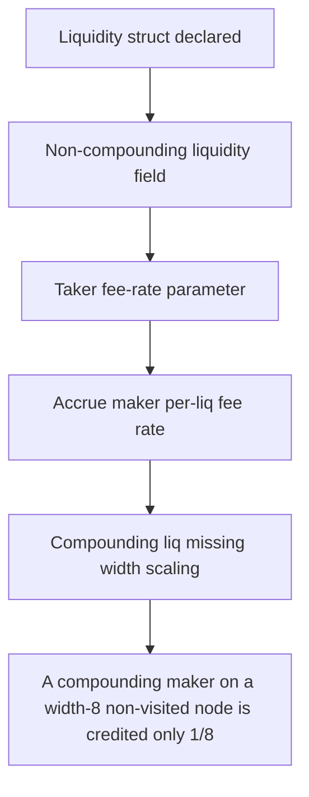

# Ammplify: A compounding maker on a width-8 non-visited node is credited only 1/8 (1 ether) of the 8 

> **Vulnerability classes:** vuln/locked-funds · vuln/reward-accounting
>
> **Reproduction:** a faithful minimal reproduction of the vulnerable finding — the vulnerable function is reproduced **verbatim** (marked `@>`) with faithful minimal doubles; local deploy, no fork.

<!-- source-auditvault: https://github.com/Auditware/AuditVault/blob/main/findings/63178-h-12-missing-width-scaling-in-feewalkerup-non-visited-underc.md -->

## Root cause

A compounding maker on a width-8 non-visited node is credited only 1/8 (1 ether) of the 8 ether of fees it earned; the ~87.5% shortfall (7 ether) is stranded and permanently unclaimable, recorded as LOST-FEE to the SINK.

```solidity
        node.fees.makerXFeesPerLiqX128 += colMakerXRateX128;
        node.fees.makerYFeesPerLiqX128 += colMakerYRateX128;
        // We round down to avoid overpaying dust.
        uint256 compoundingLiq = node.liq.mLiq - node.liq.ncLiq; // @> missing `* key.width()`: compounding maker fees undercredited by a factor of width on non-visited nodes
        node.fees.xCFees = add128Fees(
            node.fees.xCFees,
```

## Why it's exploitable here

A compounding maker on a width-8 non-visited node is credited only 1/8 (1 ether) of the 8 ether of fees it earned; the ~87.5% shortfall (7 ether) is stranded and permanently unclaimable, recorded as LOST-FEE to the SINK.

## Attack path



## Marked-line walkthrough (Playground)

The EVM Playground pins each step to the exact executed source line in `0x671d353a77…`:

1. **L41** — Liquidity struct declared: Setup: the `Liq` struct holds a node's compounding and non-compounding liquidity figures.
2. **L43** — Non-compounding liquidity field: Setup: `ncLiq` is the node's non-compounding liquidity, subtracted to isolate compounding liq.
3. **L87** — Taker fee-rate parameter: Setup: incoming `colTakerYRateX128` fee-rate input for the walk-up accrual.
4. **L97** — Accrue maker per-liq fee rate: Adds `colMakerXRateX128` into the node's per-liquidity maker fee accumulator.
5. **L100** — Compounding liq missing width scaling: Root cause: `compoundingLiq` is raw `mLiq - ncLiq` with no node-width multiplier, so a width-8 node credits only 1/8 of earned fees.
6. **L107** — Fold under-scaled fees in: Adds the under-scaled compounding fees into `yCFees`, locking in the ~87.5% shortfall the maker can never claim.
7. **L123** — Fee-summation helper: Setup: `add128Fees` sums the base and addend fee amounts — here summing the already-undercredited value.

## PoC

Registry (Foundry, local deploy — verbatim vulnerable source + harm-asserting test + negative control):

```bash
cd 63178-h-12-missing-width-scaling-in-feewalkerup-non-visited-underc_exp
forge test -vvv
```

The browser Playground replays the same synthetic opcode-for-opcode and measures the harm: **A compounding maker on a width-8 non-visited node is credited only 1/8 (1 ether) of the 8 ether of fees it earned; the ~87.5% shortfall (7 e**. Both gates are green (registry `forge test` PASS + Playground `_verify-poc` **VERDICT: PASS**).
