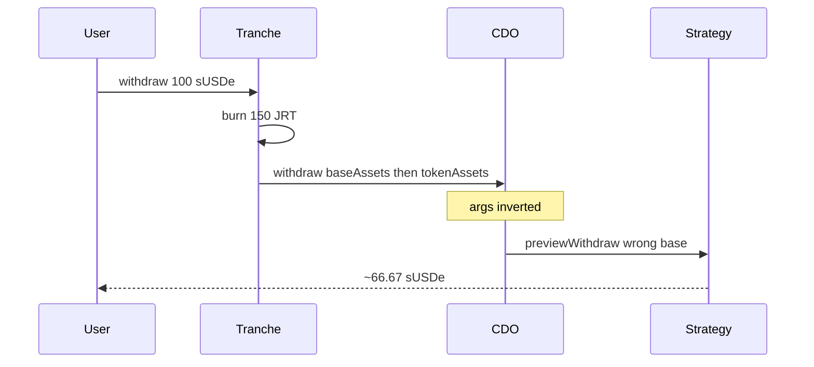

# Strata Tranches — sUSDe withdrawers always incur a loss (inverted CDO params)

> **Vulnerability classes:** wrong-order · indirect-loss · parameter-swap

> **Reproduction:** self-contained Foundry PoC, forge-std only, no fork.
> Full trace: [output.txt](output.txt).

<!-- non-defihacklabs -->
<!-- source-auditvault: https://github.com/Auditware/AuditVault/blob/main/findings/63222-withdrawers-of-susde-always-incur-a-loss-because-parameters.md -->
<!-- date: 2025-10 -->

**AuditVault taxonomy:** `severity/high` · `sector/oracle` · `sector/staking` · `platform/cyfrin` · `wrong-order` · `indirect-loss`

---

## Key info

| | |
|---|---|
| **Impact** | **HIGH** — withdrawer burns full Tranche shares but receives ~66% of requested sUSDe |
| **Protocol** | Strata Tranches v2.0 |
| **Vulnerable code** | `Tranche::_withdraw` → `cdo.withdraw(..., baseAssets, tokenAssets)` inverted |
| **Bug class** | Swapped call arguments |
| **Finding** | Cyfrin · Strata 2025-10-08 · #63222 |
| **Report** | [Cyfrin Strata](https://github.com/solodit/solodit_content/blob/main/reports/Cyfrin/2025-10-08-cyfrin-strata-tranches-v2.0.md) |
| **Compiler** | `^0.8.24` |

---

## TL;DR

1. Withdraw of 100 sUSDe (worth 150 USDe at 1.5 rate) burns 150 JRT shares.
2. Tranche passes `(baseAssets, tokenAssets)` but CDO expects `(tokenAmount, baseAssets)`.
3. Strategy runs `previewWithdraw(tokenAssets)` instead of `previewWithdraw(baseAssets)` → ~66.67 sUSDe out.
4. User permanently loses USDe value relative to burned shares.

## The vulnerable code

```solidity
cdo.withdraw(address(this), token, baseAssets, tokenAssets, receiver); // @> VULN inverted
// FIX: cdo.withdraw(address(this), token, tokenAssets, baseAssets, receiver);
```

## Root cause

Argument order mismatch between Tranche and CDO/Strategy withdraw APIs.

## Preconditions

- sUSDe/USDe exchange rate ≠ 1 (after yield).
- User withdraws sUSDe (not plain USDe).

## Attack walkthrough

1. Bootstrap sUSDe rate to 1.5 via yield donation.
2. Deposit 100 sUSDe → 150 JRT.
3. Withdraw 100 sUSDe → all shares burned, ~66.67 sUSDe returned.

## Diagrams



## Impact

Every sUSDe withdrawal under-pays the user while burning full share entitlement.

## Sources

- [AuditVault #63222](https://github.com/Auditware/AuditVault/blob/main/findings/63222-withdrawers-of-susde-always-incur-a-loss-because-parameters.md)
- [Cyfrin Strata Tranches v2.0](https://github.com/solodit/solodit_content/blob/main/reports/Cyfrin/2025-10-08-cyfrin-strata-tranches-v2.0.md)
- Fixed: Strata-Money/contracts-tranches@31d9b72
