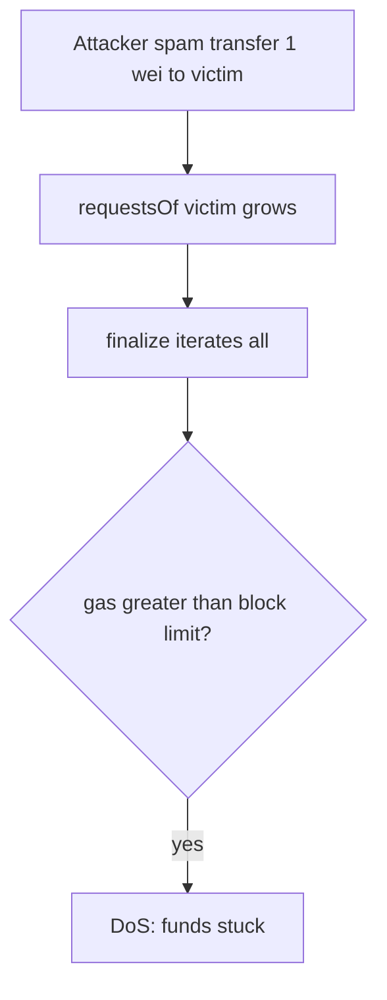

# Strata Tranches — withdrawal active requests DoS'd by malicious users

> **Vulnerability classes:** griefing · unbounded-loop · missing access control

> **Reproduction:** self-contained Foundry PoC (sample+extrapolate gas). forge-std only.

<!-- non-defihacklabs -->
<!-- source-auditvault: https://github.com/Auditware/AuditVault/blob/main/findings/63223-users-can-get-their-withdrawal-active-requests-dosed-by-mali.md -->
<!-- date: 2025-10 -->

**AuditVault taxonomy:** `severity/high` · `sector/staking` · `platform/cyfrin` · `griefing` · `unbounded-loop` · `dos-resistance`

---

## Key info

| | |
|---|---|
| **Impact** | **HIGH** — victim finalize() OOGs; USDe unstake stuck |
| **Protocol** | Strata Tranches · UnstakeCooldown |
| **Vulnerable code** | `UnstakeCooldown.transfer` pushes to any `to` without ACL |
| **Bug class** | Missing access control + unbounded finalize loop |
| **Finding** | Cyfrin · Strata 2025-10-08 · #63223 |

---

## TL;DR

Anyone can call `transfer(..., victim, 1 wei)` and inflate the victim's request array. `finalize` iterates all entries → OOG after ~35k spam (shown via sample×extrapolate).

## The vulnerable code

```solidity
requestsOf[to].push(...); // @> VULN: no access control
// FIX: ACL + soft/hard request limits
```

## Diagrams



## Impact

Victim cannot complete USDe unstake while spam requests remain.

## Sources

- [AuditVault #63223](https://github.com/Auditware/AuditVault/blob/main/findings/63223-users-can-get-their-withdrawal-active-requests-dosed-by-mali.md)
- [Cyfrin Strata Tranches v2.0](https://github.com/solodit/solodit_content/blob/main/reports/Cyfrin/2025-10-08-cyfrin-strata-tranches-v2.0.md)
