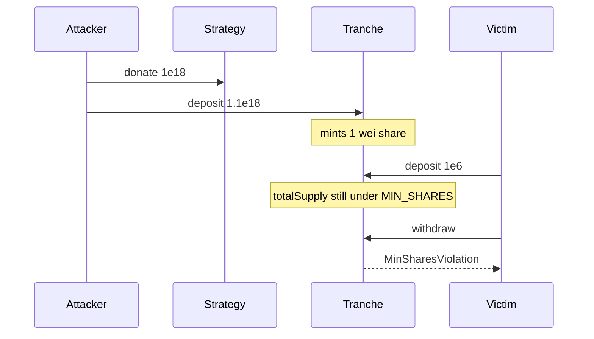

# Strata Tranches — donation-prevention gamed → withdrawals stuck

> **Vulnerability classes:** frozen-funds · donation inflation · MIN_SHARES

> **Reproduction:** self-contained Foundry PoC, forge-std only.

<!-- non-defihacklabs -->
<!-- source-auditvault: https://github.com/Auditware/AuditVault/blob/main/findings/63224-mechanism-to-prevent-donation-attack-can-be-gamed-to-cause-w.md -->
<!-- date: 2025-10 -->

**AuditVault taxonomy:** `severity/high` · `sector/vault` · `platform/cyfrin` · `frozen-funds` · `locked-funds`

---

## Key info

| | |
|---|---|
| **Impact** | **HIGH** — all withdrawals revert MinSharesViolation; assets trapped in Strategy |
| **Protocol** | Strata Tranches |
| **Vulnerable code** | `_onAfterWithdrawalChecks` requires `totalSupply >= MIN_SHARES` |
| **Bug class** | Donation inflation under min-share floor |
| **Finding** | Cyfrin · Strata 2025-10-08 · #63224 |

---

## TL;DR

Donate to Strategy before first deposit → first mint is 1 wei of shares. Later large deposits still leave `totalSupply < MIN_SHARES`. Every withdraw reverts; capital stuck.

## The vulnerable code

```solidity
if (totalSupply < MIN_SHARES) revert MinSharesViolation(); // @> VULN
// FIX: seed dead shares / sweep donations before enabling deposits
```

## Diagrams



## Impact

User-deposited assets cannot be withdrawn from Strategy.

## Sources

- [AuditVault #63224](https://github.com/Auditware/AuditVault/blob/main/findings/63224-mechanism-to-prevent-donation-attack-can-be-gamed-to-cause-w.md)
- [Cyfrin Strata](https://github.com/solodit/solodit_content/blob/main/reports/Cyfrin/2025-10-08-cyfrin-strata-tranches-v2.0.md)
- Fixed: Strata-Money/contracts-tranches@f344885
