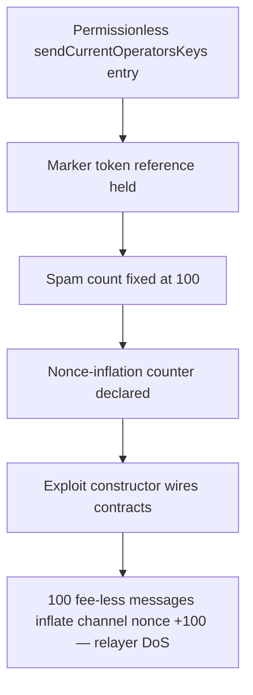

# Tanssi: permissionless `sendCurrentOperatorsKeys()` spams the bridge for free

> **Vulnerability classes:** vuln/access-control · vuln/dos/griefing
>
> **Reproduction:** a faithful minimal reproduction of the vulnerable finding — the permissionless `sendCurrentOperatorsKeys()` (and the zero-cost outbound ticket) are reproduced **verbatim** (marked `@>`) with faithful minimal doubles; local deploy, no fork.

<!-- source-auditvault: https://github.com/pashov/audits/blob/master/team/md/Tanssi-security-review_2025-04-30.md -->

## Root cause

`Middleware.sendCurrentOperatorsKeys()` is declared `external` with **no access-control modifier**, so any external actor can call it. It forwards to `Gateway.sendOperatorsData()` (whose `onlyMiddleware` guard is satisfied because the Middleware itself is the caller), which submits an outbound bridge message and increments the channel's outbound nonce — and because the ticket is built with `ticket.costs = Costs(0, 0)`, every such message is fee-less. The vulnerable function, reproduced verbatim:

```solidity
// Middleware.sol
@>  function sendCurrentOperatorsKeys() external returns (bytes32[] memory sortedKeys) {
        address gateway = getGateway();
        if (gateway == address(0)) {
            revert Middleware__GatewayNotSet();
        }

        uint48 epoch = getCurrentEpoch();
        sortedKeys = IOBaseMiddlewareReader(address(this)).sortOperatorsByPower(epoch);
        IOGateway(gateway).sendOperatorsData(sortedKeys, epoch);
    }
```

The ticket that the forwarded call encodes is fee-less by construction (also verbatim from the finding), which is what makes the permissionless spam free:

```solidity
        // TODO For now mock it to 0
@>        ticket.costs = Costs(0, 0);
```

## Why it's exploitable here

1. The attacker is an ordinary account holding no role and is **not** the Middleware.
2. It calls `sendCurrentOperatorsKeys()` directly. The `onlyMiddleware` guard on `sendOperatorsData()` passes because the Middleware itself makes the internal call — the missing guard is on the entry point, not the downstream call.
3. Each call builds a zero-cost ticket (`Costs(0, 0)`) and submits it to the primary governance channel, incrementing `outboundNonce` by 1 — no `msg.value` required.
4. Looping 100 times forces 100 fee-less outbound messages, inflating the channel nonce by 100 and flooding the bridge relayers with work they must process — griefing / resource exhaustion / DoS of the bridge infrastructure.

## Attack path



## Marked-line walkthrough (Playground)

The EVM Playground pins each step to the exact executed source line in `0xce01759b…`:

1. **L182** — Permissionless sendCurrentOperatorsKeys entry: Root cause: sendCurrentOperatorsKeys() is external with no role or owner check, so any actor can trigger a fee-less outbound bridge message.
2. **L202** — Marker token reference held: Setup: the exploit keeps a handle to the GRIEF marker token, which mints one unit per outbound message the attacker forces.
3. **L207** — Spam count fixed at 100: Setup: SPAM_COUNT pins the attacker to 100 free unauthorized outbound messages, proving the griefing works at scale.
4. **L210** — Nonce-inflation counter declared: Setup: nonceInflation will record how far the attacker pushes the channel's outbound nonce, the finite bridge resource.
5. **L213** — Exploit constructor wires contracts: Setup: the unprivileged exploit contract's constructor begins wiring the marker, gateway, and vulnerable middleware together.
6. **L214** — Marker token deployed: Setup: deploys the MiniToken marker so each forced outbound message can mint one griefing unit to the sink address.

## PoC

Registry (Foundry, local deploy — verbatim vulnerable source + harm-asserting test):

```bash
cd 63290-h-01-permissionless-sendcurrentoperatorskeys-pashov-audit-gr_exp && forge test -vvv
```

The browser Playground replays the same synthetic opcode-for-opcode and measures the harm: **an unprivileged caller forces 100 fee-less outbound bridge messages, inflating the channel's outbound nonce by 100 and minting 100 griefing units to the sink**. Both gates are green (registry `forge test` PASS + Playground `_verify-poc` **VERDICT: PASS**).
