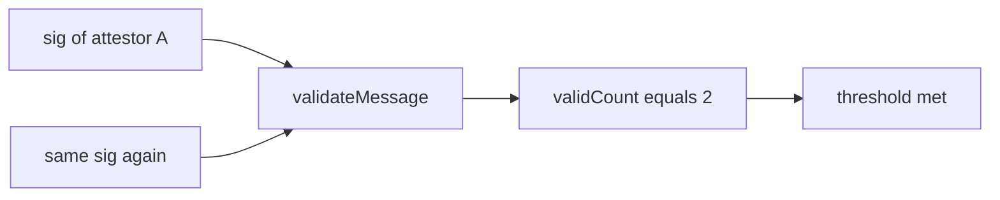

# SXT — [C-01] Accepting duplicate signatures from one signer

> **Vulnerability classes:** broken-logic · role-bypass · bridge-validator-threshold

> **Reproduction:** self-contained Foundry PoC, forge-std only.

<!-- non-defihacklabs -->
<!-- source-auditvault: https://github.com/Auditware/AuditVault/blob/main/findings/63314-c-01-accepting-duplicate-signatures-from-one-signer-pashov-a.md -->
<!-- date: 2025-03 -->

**AuditVault taxonomy:** `severity/high` · `sector/staking` · `platform/pashov` · `broken-logic` · `role-bypass` · `bridge-validator-threshold`

---

## Key info

| | |
|---|---|
| **Impact** | **HIGH** — single attestor meets multi-sig threshold via replayed signature |
| **Protocol** | SXT SubstrateSignatureValidator |
| **Vulnerable code** | `validateMessage` increments count without signer dedup |
| **Bug class** | Missing signature uniqueness check |
| **Finding** | Pashov · SXT 2025-03-31 · #63314 |

---

## TL;DR

Threshold = 2. Attacker submits the same valid `(v,r,s)` twice. Both recover to one attestor; both count. `validateMessage` returns true.

## The vulnerable code

```solidity
if (attestorIndex < attestorsLength && _attestors[attestorIndex] == recoveredAddress) {
    ++validSignaturesCount; // @> VULN no dedup
}
// FIX: skip if signer already counted
```

## Diagrams



## Impact

Forged multi-attestor consensus from one honest signature → bridge/message validation bypass.

## Sources

- [AuditVault #63314](https://github.com/Auditware/AuditVault/blob/main/findings/63314-c-01-accepting-duplicate-signatures-from-one-signer-pashov-a.md)
- [Pashov SXT review 2025-03-31](https://github.com/pashov/audits/blob/master/team/md/SXT-security-review_2025-03-31.md)
