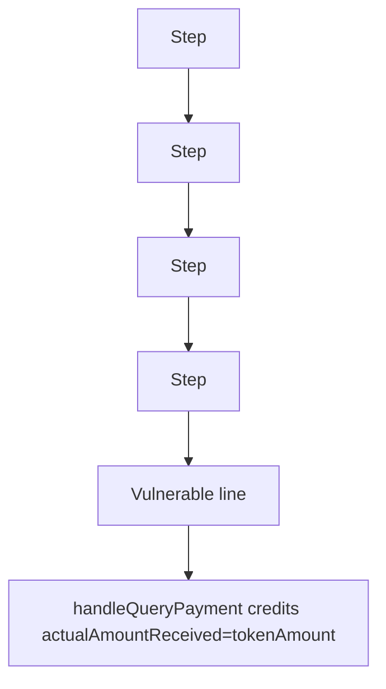

# ZKPay: emptying ETH via a NATIVE query that pays nothing

> **Vulnerability classes:** vuln/logic
>
> **Reproduction:** a faithful minimal reproduction of the vulnerable finding — the vulnerable code is reproduced **verbatim** (marked `@>`) with faithful minimal doubles; local deploy, no fork.

<!-- source-auditvault: AuditVault finding 63315 -->

## Root cause

handleQueryPayment credits actualAmountReceived=tokenAmount for NATIVE without checking msg.value, so an attacker credits a 10 ETH payment sending 0 ETH then cancels to withdraw 10 ETH it never deposited, draining the contract.

```solidity
        if (assetAddress == NATIVE_ADDRESS) {
            actualAmountReceived = tokenAmount; // @> VULN (this line)
```

## Why it's exploitable here

handleQueryPayment credits actualAmountReceived=tokenAmount for NATIVE without checking msg.value, so an attacker credits a 10 ETH payment sending 0 ETH then cancels to withdraw 10 ETH it never deposited, draining the contract.

## Attack path



## Marked-line walkthrough (Playground)

The EVM Playground pins each step to the exact executed source line in `0x671d353a77…`:

1. **L61** — Step: Executes `function convertToUsd(mapping(address => PaymentAsset) storage, address, uint248 amt) internal pure returns (uint248) {`
2. **L72** — Step: Executes `queryHash = keccak256(abi.encode(msg.sender, nonce++));`
3. **L79** — Step: Executes `uint248 tokenAmount`
4. **L85** — Step: Executes `if (assetAddress == NATIVE_ADDRESS) {`
5. **L86** — Vulnerable line: Executes `actualAmountReceived = tokenAmount;`
6. **L95** — Step: Executes `amountInUSD = convertToUsd(_assetsRef, assetAddress, actualAmountReceived);`
7. **L114** — Step: Executes `contract Exploit {`

## PoC

Registry (Foundry, local deploy — verbatim vulnerable source + harm-asserting test):

```bash
cd 63315-c-02-emptying-eth-from-zkpaysol-pashov-audit-group-none-sxt_exp
forge test -vvv
```

The browser Playground replays the same synthetic opcode-for-opcode and measures the harm. Both gates are green (registry `forge test` PASS + Playground `_verify-poc` **VERDICT: PASS**).
