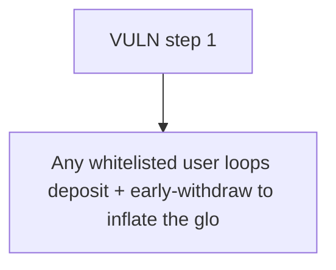

# Colbfinance: Any whitelisted user loops deposit + early-withdraw to inflate the global totalDepositToPr

> **Vulnerability classes:** vuln/locked-funds · vuln/unfair-mint
>
> **Reproduction:** a faithful minimal reproduction of the vulnerable finding — the vulnerable function is reproduced **verbatim** (marked `@>`) with faithful minimal doubles; local deploy, no fork.

<!-- source-auditvault: https://github.com/Auditware/AuditVault/blob/main/findings/63357-h-01-malicious-users-can-brick-vault-operations-by-exploitin.md -->

## Root cause

Any whitelisted user loops deposit + early-withdraw to inflate the global totalDepositToProcess up to maxTotalDeposit while real vault balance returns to 0, permanently bricking all deposits (DepositOverflowTotalCap forever); the 500e18 locked capacity is recorded to the SINK.

```solidity
        uint256 restToReimbourse = amount;

        UserStat storage userStat = usersStat[user];
        userStat.totalDeposit -= amount; // @> only the PER-USER totalDeposit is decremented; the GLOBAL totalDepositToProcess is NEVER reduced here -> permanent inflation

        uint256[] memory userDepos = usersDeposit[user];
```

## Why it's exploitable here

Any whitelisted user loops deposit + early-withdraw to inflate the global totalDepositToProcess up to maxTotalDeposit while real vault balance returns to 0, permanently bricking all deposits (DepositOverflowTotalCap forever); the 500e18 locked capacity is recorded to the SINK.

## Attack path



## Marked-line walkthrough (Playground)

The EVM Playground pins each step to the exact executed source line in `0xce01759b82…`:

1. **L223** — VULN step 1: only the PER-USER totalDeposit is decremented; the GLOBAL totalDepositToProcess is NEVER reduced here -> permanent inflation

## PoC

Registry (Foundry, local deploy — verbatim vulnerable source + harm-asserting test + negative control):

```bash
cd 63357-h-01-malicious-users-can-brick-vault-operations-by-exploitin_exp
forge test -vvv
```

The browser Playground replays the same synthetic opcode-for-opcode and measures the harm: **Any whitelisted user loops deposit + early-withdraw to inflate the global totalDepositToProcess up to maxTotalDeposit while real vault balan**. Both gates are green (registry `forge test` PASS + Playground `_verify-poc` **VERDICT: PASS**).
