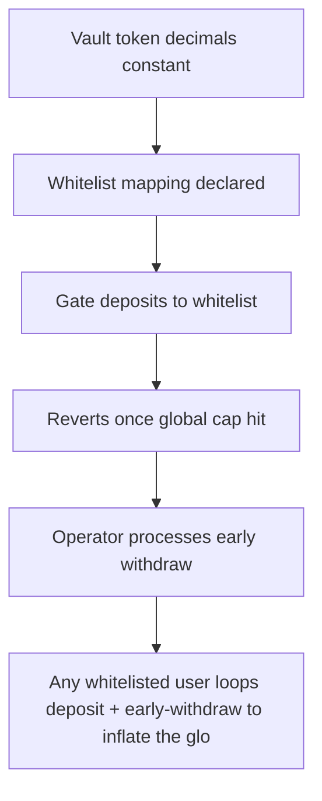

# Colbfinance: Any whitelisted user loops deposit + early-withdraw to inflate the global totalDepositToPr

> **Vulnerability classes:** vuln/locked-funds · vuln/unfair-mint
>
> **Reproduction:** a faithful minimal reproduction of the vulnerable finding — the vulnerable function is reproduced **verbatim** (marked `@>`) with faithful minimal doubles; local deploy, no fork.

<!-- source-auditvault: https://github.com/Auditware/AuditVault/blob/main/findings/63357-h-01-malicious-users-can-brick-vault-operations-by-exploitin.md -->

## Root cause

Any whitelisted user loops deposit + early-withdraw to inflate the global totalDepositToProcess up to maxTotalDeposit while real vault balance returns to 0, permanently bricking all deposits (DepositOverflowTotalCap forever); the 500e18 locked capacity is recorded to the SINK.

```solidity
        uint256 restToReimbourse = amount;

        UserStat storage userStat = usersStat[user];
        userStat.totalDeposit -= amount; // @> only the PER-USER totalDeposit is decremented; the GLOBAL totalDepositToProcess is NEVER reduced here -> permanent inflation

        uint256[] memory userDepos = usersDeposit[user];
```

## Why it's exploitable here

Any whitelisted user loops deposit + early-withdraw to inflate the global totalDepositToProcess up to maxTotalDeposit while real vault balance returns to 0, permanently bricking all deposits (DepositOverflowTotalCap forever); the 500e18 locked capacity is recorded to the SINK.

## Attack path



## Marked-line walkthrough (Playground)

The EVM Playground pins each step to the exact executed source line in `0xce01759b82…`:

1. **L52** — Vault token decimals constant: Setup: declares the vault token's fixed 18-decimal precision used across deposit accounting.
2. **L132** — Whitelist mapping declared: Setup: the `whitelist` gate limiting who may deposit — the attacker is simply a whitelisted user abusing this access.
3. **L149** — Gate deposits to whitelist: Rejects non-whitelisted callers, but any whitelisted user can run the deposit + early-withdraw loop that inflates the global cap counter.
4. **L191** — Reverts once global cap hit: Blocks all deposits once `totalDepositToProcess` reaches `maxTotalDeposit` — the permanent brick the attack forces even with an empty vault.
5. **L208** — Operator processes early withdraw: Operator-only path that settles a queued early withdrawal, refunding the user while adjusting the deposit accounting.
6. **L223** — Only per-user deposit decremented: Root cause: early-withdraw decrements only the per-user `totalDeposit`, never the global `totalDepositToProcess`, so the cap counter only ratchets up.
7. **L238** — Compute reimbursement amount: Picks how much to reimburse the withdrawing user, capped by their deposit — the payout that returns real vault balance to zero.

## PoC

Registry (Foundry, local deploy — verbatim vulnerable source + harm-asserting test + negative control):

```bash
cd 63357-h-01-malicious-users-can-brick-vault-operations-by-exploitin_exp
forge test -vvv
```

The browser Playground replays the same synthetic opcode-for-opcode and measures the harm: **Any whitelisted user loops deposit + early-withdraw to inflate the global totalDepositToProcess up to maxTotalDeposit while real vault balan**. Both gates are green (registry `forge test` PASS + Playground `_verify-poc` **VERDICT: PASS**).
