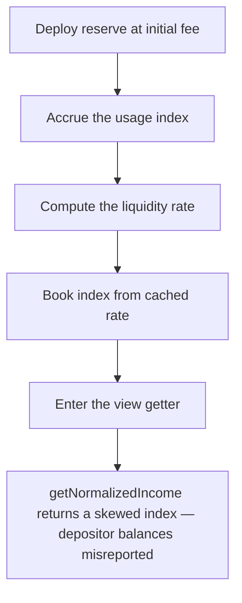

# RegnumAurum: parameter change skews the interest getters

> **Vulnerability classes:** vuln/wrong-state · vuln/logic
>
> **Reproduction:** a faithful minimal reproduction of the vulnerable finding — the vulnerable `getLiquidityIndex` view is reproduced **verbatim** (marked `@>`) with faithful Aave-style RAY-math doubles; local deploy, no fork.

<!-- source-auditvault: https://github.com/pashov/audits/blob/master/team/md/RegnumAurum-security-review_2025-08-12.md -->

## Root cause

`updateState` books the elapsed interest into `liquidityIndex` using the **cached** `currentLiquidityRate` (the rate last calculated, with the fee that was in force at the last update). But the view getter `getLiquidityIndex` — which backs `getNormalizedIncome` / `getNormalizedDebt` — **recalculates** the liquidity rate on the fly from the *live* `protocolFeeRate`. When the protocol changes `protocolFeeRate` after the last update, the getter attributes the entire elapsed `timeDelta` to a rate that was never actually applied, so it returns a value that diverges from the index the protocol will actually book. The vulnerable getter, reproduced verbatim:

```solidity
    function getLiquidityIndex(ReserveData storage reserve, ReserveRateData storage rateData) internal view returns (uint256) {
        uint256 timeDelta = block.timestamp - uint256(reserve.lastUpdateTimestamp);
        if(timeDelta < 1) {
            return reserve.liquidityIndex;
        }

        return calculateLiquidityIndex(
@>          calculateLiquidityRate(rateData.currentUtilizationRate, rateData.currentUsageRate, rateData.protocolFeeRate, reserve.totalUsage),
            timeDelta,
            reserve.liquidityIndex
        );
    }
```

Only `protocolFeeRate` needs to change for the recomputed rate to differ from the cached one — and the finding notes the same skew hits `getNormalizedDebt` when other rate parameters change.

## Why it's exploitable here

Following the synthetic driver with the reserve consistent at the last update (fee 10%, usage rate 10%, utilization 0.8) and one year elapsed:

1. Income rate at 10% fee = `0.08 * (1 - 0.10)` = `0.072 RAY`, so over one year the getter and the booked index both give `liquidityIndex = 1.072e27` — they agree.
2. The protocol raises `protocolFeeRate` from **10% → 30%** (a normal parameter change).
3. The getter now recomputes the rate as `0.08 * (1 - 0.30)` = `0.056 RAY`, returning `liquidityIndex = 1.056e27` for the *same* elapsed year.
4. `updateState` then books the year using the **cached** 10%-fee rate, writing `1.072e27` — the value the protocol actually accrues.
5. A depositor with a scaled balance of `1000` reads `getNormalizedIncome` and sees `1056` tokens, while the protocol has booked `1072`: a **16-token** under-report of their balance, propagated to every consumer that reads the getter.

## Attack path



## Marked-line walkthrough (Playground)

The EVM Playground pins each step to the exact executed source line in `0x8ea53755…`:

1. **L87** — Deploy reserve at initial fee: Setup: the reserve is constructed with a starting protocolFeeRate, and its liquidity rate is cached against that fee for later accrual.
2. **L124** — Accrue the usage index: The compounded-interest helper folds the elapsed time into the usage (debt) index using the cached usage rate.
3. **L139** — Compute the liquidity rate: calculateLiquidityRate derives depositor income as borrow rate times utilization, scaled down by (1 - protocolFeeRate).
4. **L160** — Book index from cached rate: updateState books the elapsed accrual into liquidityIndex using the cached currentLiquidityRate — the fee that was actually in force.
5. **L177** — Enter the view getter: getLiquidityIndex, the view backing getNormalizedIncome, runs its own accrual path independent of the booked index.
6. **L178** — Getter recomputes the rate: Root cause: the getter measures elapsed time here, then recomputes the rate from the live protocolFeeRate instead of the cached rate updateState booked.
7. **L191** — Return skewed income to callers: getNormalizedIncome returns this skewed index to every consumer, so a depositor's reported balance diverges from what the protocol actually accrues.

## PoC

Registry (Foundry, local deploy — verbatim vulnerable source + harm-asserting test):

```bash
cd 63401-h-01-parameter-change-skews-getters-pashov-audit-group-none_exp && forge test -vvv
```

The browser Playground replays the same synthetic opcode-for-opcode and measures the harm: **fee 10% → 30% over one year skews `getNormalizedIncome` from the booked `1.072e27` down to `1.056e27`, under-reporting a 1000-scaled depositor by 16 tokens**. Both gates are green (registry `forge test` PASS + Playground `_verify-poc` **VERDICT: PASS**).
