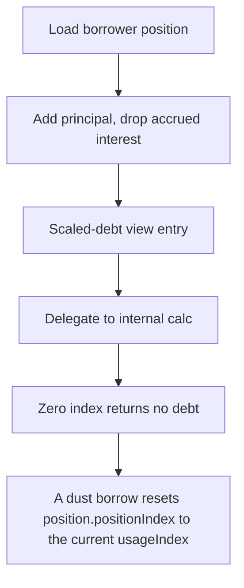

# RegnumAurum: A dust borrow resets position.positionIndex to the current usageIndex while adding only pr

> **Vulnerability classes:** vuln/locked-funds
>
> **Reproduction:** a faithful minimal reproduction of the vulnerable finding — the vulnerable function is reproduced **verbatim** (marked `@>`) with faithful minimal doubles; local deploy, no fork.

<!-- source-auditvault: https://github.com/Auditware/AuditVault/blob/main/findings/63402-h-02-borrowers-can-avoid-paying-interest-for-lenders-pashov.md -->

## Root cause

A dust borrow resets position.positionIndex to the current usageIndex while adding only principal to rawDebtBalance, collapsing usageIndex/positionIndex to ~1 and wiping 50 crvUSD of accrued interest from the borrower's tracked debt, so lenders never receive it.

```solidity
        // Transfer borrowed amount to user
        IRToken(reserve.reserveRTokenAddress).transferAsset(msg.sender, amount);

        position.rawDebtBalance += underlyingAmount; // @> only the new principal is added; the accrued interest returned by mint is ignored while positionIndex is reset to usageIndex, collapsing usageIndex/positionIndex to ~1 and wiping all prior interest
    }

```

## Why it's exploitable here

A dust borrow resets position.positionIndex to the current usageIndex while adding only principal to rawDebtBalance, collapsing usageIndex/positionIndex to ~1 and wiping 50 crvUSD of accrued interest from the borrower's tracked debt, so lenders never receive it.

## Attack path



## Marked-line walkthrough (Playground)

The EVM Playground pins each step to the exact executed source line in `0xbd4fd5a3ce…`:

1. **L139** — Load borrower position: Loads the caller's borrow `position` — its `rawDebtBalance` and `positionIndex` — to update on this new borrow.
2. **L149** — Add principal, drop accrued interest: Root cause: borrow adds only principal to `rawDebtBalance` while the position's index is reset to `usageIndex`, wiping previously accrued interest.
3. **L152** — Scaled-debt view entry: Public view returning a user's current debt including interest, derived from the raw balance and the index ratio.
4. **L153** — Delegate to internal calc: Forwards to `_positionScaledDebt`, which applies the `usageIndex`/`positionIndex` ratio the exploit collapses to ~1.
5. **L158** — Zero index returns no debt: Returns zero for an uninitialized position (`positionIndex == 0`) before the interest-scaling formula runs.
6. **L159** — Interest via index ratio: Debt = principal x `usageIndex`/`positionIndex`; after the borrow resets `positionIndex` to `usageIndex`, this ratio is ~1 so interest vanishes.
7. **L172** — Wire reserve debt token: Setup: records the reserve's debt-token address during reserve initialization.

## PoC

Registry (Foundry, local deploy — verbatim vulnerable source + harm-asserting test + negative control):

```bash
cd 63402-h-02-borrowers-can-avoid-paying-interest-for-lenders-pashov_exp
forge test -vvv
```

The browser Playground replays the same synthetic opcode-for-opcode and measures the harm: **A dust borrow resets position.positionIndex to the current usageIndex while adding only principal to rawDebtBalance, collapsing usageIndex/p**. Both gates are green (registry `forge test` PASS + Playground `_verify-poc` **VERDICT: PASS**).
