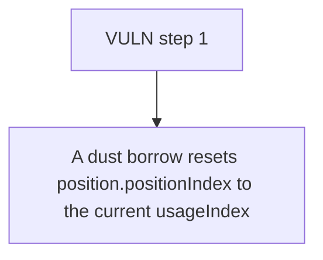

# RegnumAurum: A dust borrow resets position.positionIndex to the current usageIndex while adding only pr

> **Vulnerability classes:** vuln/locked-funds
>
> **Reproduction:** a faithful minimal reproduction of the vulnerable finding — the vulnerable function is reproduced **verbatim** (marked `@>`) with faithful minimal doubles; local deploy, no fork.

<!-- source-auditvault: https://github.com/Auditware/AuditVault/blob/main/findings/63402-h-02-borrowers-can-avoid-paying-interest-for-lenders-pashov.md -->

## Root cause

A dust borrow resets position.positionIndex to the current usageIndex while adding only principal to rawDebtBalance, collapsing usageIndex/positionIndex to ~1 and wiping 50 crvUSD of accrued interest from the borrower's tracked debt, so lenders never receive it.

```solidity
        // Transfer borrowed amount to user
        IRToken(reserve.reserveRTokenAddress).transferAsset(msg.sender, amount);

        position.rawDebtBalance += underlyingAmount; // @> only the new principal is added; the accrued interest returned by mint is ignored while positionIndex is reset to usageIndex, collapsing usageIndex/positionIndex to ~1 and wiping all prior interest
    }

```

## Why it's exploitable here

A dust borrow resets position.positionIndex to the current usageIndex while adding only principal to rawDebtBalance, collapsing usageIndex/positionIndex to ~1 and wiping 50 crvUSD of accrued interest from the borrower's tracked debt, so lenders never receive it.

## Attack path



## Marked-line walkthrough (Playground)

The EVM Playground pins each step to the exact executed source line in `0xbd4fd5a3ce…`:

1. **L149** — VULN step 1: only the new principal is added; the accrued interest returned by mint is ignored while positionIndex is reset to usageIndex, collapsing usageIndex/positionIndex to ~1 and wiping all prior interest

## PoC

Registry (Foundry, local deploy — verbatim vulnerable source + harm-asserting test + negative control):

```bash
cd 63402-h-02-borrowers-can-avoid-paying-interest-for-lenders-pashov_exp
forge test -vvv
```

The browser Playground replays the same synthetic opcode-for-opcode and measures the harm: **A dust borrow resets position.positionIndex to the current usageIndex while adding only principal to rawDebtBalance, collapsing usageIndex/p**. Both gates are green (registry `forge test` PASS + Playground `_verify-poc` **VERDICT: PASS**).
