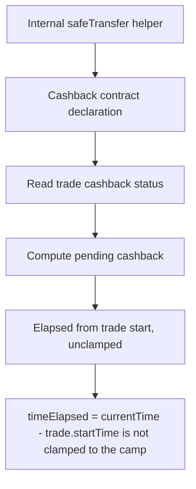

# Super DCA: Cashback elapsed-time not clamped to campaign start

> **Vulnerability classes:** vuln/theft · vuln/reward-accounting
>
> **Reproduction:** a faithful minimal reproduction of the vulnerable finding — the vulnerable function is reproduced **verbatim** (marked `@>`) with faithful minimal doubles; local deploy, no fork.

<!-- source-auditvault: https://github.com/Auditware/AuditVault/blob/main/findings/63419-h-1-users-with-pre-campaign-trades-will-drain-cashback-funds.md -->

## Root cause

timeElapsed = currentTime - trade.startTime is not clamped to the campaign's start, so a trade opened before the campaign claims retroactive cashback for pre-campaign epochs, draining the pool (50 of 60 USDC) that a correctly-clamped contract would owe as 0.

```solidity
    uint256 currentTime = block.timestamp;
    if (currentTime <= trade.startTime) return (0, 0);

    uint256 timeElapsed = currentTime - trade.startTime; // @> no clamp to cashbackClaim.startTime: counts pre-campaign time as completed epochs
    completedEpochs = timeElapsed / cashbackClaim.duration;
    incompleteEpochTime = timeElapsed % cashbackClaim.duration;
```

## Why it's exploitable here

A trade created 5.5 epochs BEFORE the campaign start claims retroactive cashback for 5 completed epochs (50 USDC, 6-dp) — all predating the campaign — draining the USDC cashback pool from 60 to 10 USDC; a correctly-clamped contract owes 0, so all 50 USDC is theft that the attacker EOA receives.

## Attack path



## Marked-line walkthrough (Playground)

The EVM Playground pins each step to the exact executed source line in `0xce01759b82…`:

1. **L45** — Internal safeTransfer helper: Setup: internal ERC20 transfer helper used to pay cashback out of the USDC pool.
2. **L192** — Cashback contract declaration: Setup: the `SuperDCACashback` contract that pays trade-based cashback per completed epoch.
3. **L267** — Read trade cashback status: View reporting a trade's owed/pending cashback — the figure that decides how much the attacker can claim.
4. **L294** — Compute pending cashback: Calls the calculator that turns elapsed time into owed cashback — the amount inflated by counting pre-campaign epochs.
5. **L347** — Elapsed from trade start, unclamped: Root cause: elapsed time is measured from the trade's own `startTime` and never clamped to campaign start, so pre-campaign epochs earn cashback.
6. **L356** — Cast flow rate to uint: Converts the signed DCA flow rate to unsigned; multiplied by the inflated elapsed time to size the payout.
7. **L425** — Fetch trade with early start: Loads the trade from the external trade contract, carrying the pre-campaign `startTime` the elapsed-time bug trusts.

## PoC

Registry (Foundry, local deploy — verbatim vulnerable source + harm-asserting test + negative control):

```bash
cd 63419-h-1-users-with-pre-campaign-trades-will-drain-cashback-funds_exp
forge test -vvv
```

The browser Playground replays the same synthetic opcode-for-opcode and measures the harm: **A trade created 5.5 epochs BEFORE the campaign start claims retroactive cashback for 5 completed epochs (50 USDC, 6-dp) — all predating the campaign — draining the USDC cashback pool from 60 to 10 USDC; a correctly-clamped contract owes 0, so all 50 USDC is theft that the attacker EOA receives.**. Both gates are green (registry `forge test` PASS + Playground `_verify-poc` **VERDICT: PASS**).
