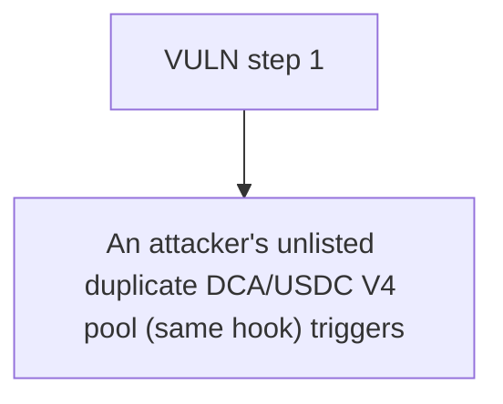

# Super DCA: An attacker's unlisted duplicate DCA/USDC V4 pool (same hook) triggers the shared per-toke

> **Vulnerability classes:** vuln/theft · vuln/reward-accounting
>
> **Reproduction:** a faithful minimal reproduction of the vulnerable finding — the vulnerable function is reproduced **verbatim** (marked `@>`) with faithful minimal doubles; local deploy, no fork.

<!-- source-auditvault: https://github.com/Auditware/AuditVault/blob/main/findings/63420-h-2-attackers-will-steal-rewards-from-legitimate-pools-by-ma.md -->

## Root cause

An attacker's unlisted duplicate DCA/USDC V4 pool (same hook) triggers the shared per-token reward accrual and captures the community donation, stealing 500e18 DCA (the community half of USDC's 1000e18 reward bucket) to the attacker EOA while the legitimately-listed pool receives 0.

```solidity
            : Currency.unwrap(key.currency0);

        // Calculate pending rewards from the external staking contract
        uint256 rewardAmount = staking.accrueReward(otherToken); // @> per-token bucket accrued (and reset) for ANY pool incl. an unlisted duplicate; NO pool-legitimacy check
        if (rewardAmount == 0) return;

```

## Why it's exploitable here

An attacker's unlisted duplicate DCA/USDC V4 pool (same hook) triggers the shared per-token reward accrual and captures the community donation, stealing 500e18 DCA (the community half of USDC's 1000e18 reward bucket) to the attacker EOA while the legitimately-listed pool receives 0.

## Attack path



## Marked-line walkthrough (Playground)

The EVM Playground pins each step to the exact executed source line in `0xe3a787a4e4…`:

1. **L324** — VULN step 1: per-token bucket accrued (and reset) for ANY pool incl. an unlisted duplicate; NO pool-legitimacy check

## PoC

Registry (Foundry, local deploy — verbatim vulnerable source + harm-asserting test + negative control):

```bash
cd 63420-h-2-attackers-will-steal-rewards-from-legitimate-pools-by-ma_exp
forge test -vvv
```

The browser Playground replays the same synthetic opcode-for-opcode and measures the harm: **An attacker's unlisted duplicate DCA/USDC V4 pool (same hook) triggers the shared per-token reward accrual and captures the community donati**. Both gates are green (registry `forge test` PASS + Playground `_verify-poc` **VERDICT: PASS**).
