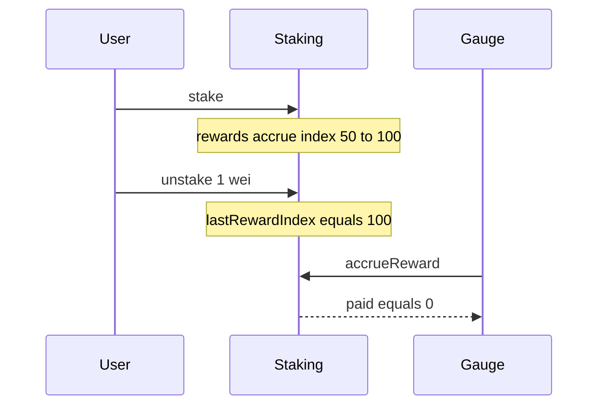

# Super DCA — H-4: Bucket rewards wiped by stake/unstake before accrue

> **Vulnerability classes:** state-update · reward-theft · reward-accounting

> **Reproduction:** self-contained Foundry PoC, forge-std only.

<!-- non-defihacklabs -->
<!-- source-auditvault: https://github.com/Auditware/AuditVault/blob/main/findings/63422-h-4-bucket-rewards-will-be-wiped-by-stakeunstake-before-accr.md -->
<!-- date: 2025-09 -->

**AuditVault taxonomy:** `severity/high` · `sector/staking` · `platform/sherlock` · `state-update` · `reward-accounting`

---

## Key info

| | |
|---|---|
| **Impact** | **HIGH** — up to 100% of pending bucket rewards lost |
| **Protocol** | SuperDCAStaking |
| **Vulnerable code** | `unstake` sets `lastRewardIndex = rewardIndex` without settling |
| **Bug class** | Index reset without accrual |
| **Finding** | Sherlock · 2025-09-super-dca · #63422 |

---

## TL;DR

After rewards accrue on a bucket, any stake/unstake resets `lastRewardIndex` to current `rewardIndex`. Subsequent `accrueReward` sees delta 0 → paid = 0.

## The vulnerable code

```solidity
info.lastRewardIndex = rewardIndex; // @> VULN in unstake/stake
// FIX: settle pending bucket rewards first
```

## Diagrams



## Impact

Stakers lose accrued rewards whenever stake/unstake races before gauge settlement.

## Sources

- [AuditVault #63422](https://github.com/Auditware/AuditVault/blob/main/findings/63422-h-4-bucket-rewards-will-be-wiped-by-stakeunstake-before-accr.md)
- [Sherlock 2025-09-super-dca #1065](https://github.com/sherlock-audit/2025-09-super-dca-judging/issues/1065)
- Fix: Super-DCA-Tech/super-dca-gauge#41
