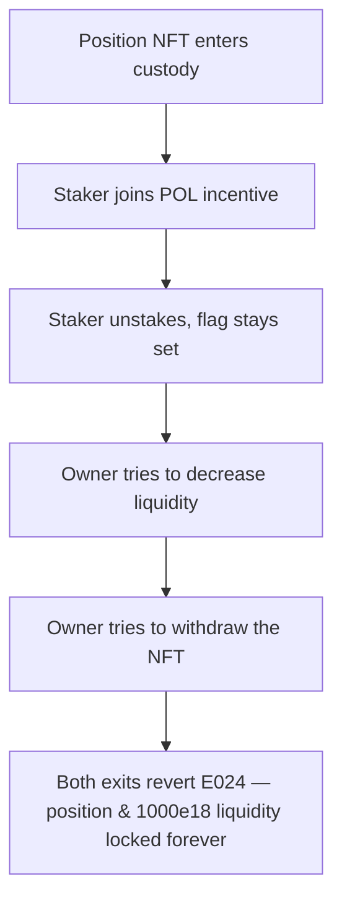

# Ouroboros: permanent `buildsPOL` flag locks staked positions forever

> **Vulnerability classes:** vuln/dos · vuln/logic
>
> **Reproduction:** a faithful minimal reproduction of the vulnerable finding — the `require(!... .buildsPOL, 'E024')` exit guards are reproduced **verbatim** (marked `@>`) with faithful minimal doubles (real ERC721 custody, real owner/stake accounting); local deploy, no fork.

<!-- source-auditvault: https://github.com/pashov/audits/blob/master/team/md/Ouroboros-security-review_2025-06-30.md -->

## Root cause

Once a staked position is flagged `buildsPOL` (protocol-owned liquidity) the flag is permanent — no code path ever resets it to `false`. Both exit paths, `decreaseLiquidity` and `withdrawToken`, hard-`require(!buildsPOL, 'E024')`, so a POL position's underlying liquidity and its NFT are locked forever. The vulnerable lines, reproduced verbatim from the finding:

```solidity
    function decreaseLiquidity(
        uint256 tokenId,
        uint128 liquidity,
        uint256 amount0Min,
        uint256 amount1Min,
        uint256 deadline
    ) external override returns (uint256 amount0, uint256 amount1) {
        // Only the position's owner can decrease liquidity.
        require(deposits[tokenId].owner == msg.sender, 'E020');
    
@>        require(!deposits[tokenId].buildsPOL, 'E024');
    }
    function withdrawToken(
        uint256 tokenId,
        address to,
        bytes memory data
    ) external override {
        // Tokens with POL cannot be withdrawn.
@>        require(!deposit.buildsPOL, 'E024');
    }
    function _calculateAndDistributeRewards(
        IncentiveKey memory key,
        Deposit memory deposit,
        bytes32 incentiveId,
        uint160 secondsPerLiquidityInsideInitialX128,
        uint32 secondsInsideInitial,
        uint128 liquidity
    ) private returns (uint256) {
        Incentive storage incentive = incentives[incentiveId];
        (, uint160 secondsPerLiquidityInsideX128, uint32 secondsInside) =
                                key.pool.snapshotCumulativesInside(deposit.tickLower, deposit.tickUpper);
        ...
    }
```

## Why it's exploitable here

A staker deposits a Uniswap v3 position NFT worth `1000e18` of underlying liquidity, then joins a POL-building incentive:

1. **Deposit** — `onERC721Received` records the staker as owner with `buildsPOL = false`.
2. **Stake** — `stakeToken` sets `buildsPOL = true`; this flag is never cleared anywhere in the contract.
3. **Unstake** — `unstakeToken` decrements `numberOfStakes` back to `0` but leaves `buildsPOL` at `true`.
4. **Exit attempt** — `decreaseLiquidity` reverts `E024`, and `withdrawToken` reverts `E024`.
5. **Harm** — the `1000e18` position NFT is stuck in the staker permanently. A control position that never staked (`buildsPOL` still `false`) withdraws normally, proving the two verbatim guards — not the test setup — are the cause of the lock.

## Attack path



## Marked-line walkthrough (Playground)

The EVM Playground pins each step to the exact executed source line in `0xce01759b…`:

1. **L120** — Position NFT enters custody: Setup: depositing the Uniswap v3 position NFT triggers onERC721Received, recording the staker as owner with buildsPOL still false.
2. **L135** — Staker joins POL incentive: Setup: stakeToken checks the caller owns the position, then joins the POL incentive that permanently sets buildsPOL = true.
3. **L142** — Staker unstakes, flag stays set: Setup: unstakeToken drops numberOfStakes back to zero but never resets buildsPOL, so the position stays permanently marked.
4. **L150** — Owner tries to decrease liquidity: Setup: the staker calls decreaseLiquidity to pull the underlying tokens back out of the still-marked position.
5. **L160** — Owner tries to withdraw the NFT: Setup: the staker instead calls withdrawToken to reclaim the position NFT itself now that numberOfStakes is zero.
6. **L170** — Permanent buildsPOL guard blocks exit: Root cause: require(!deposit.buildsPOL, 'E024') reverts because buildsPOL is set once at stake and never cleared, so no exit ever succeeds.
7. **L172** — NFT return path never reached: The delete and safeTransferFrom that would return the NFT sit just past the revert, so the position and its liquidity are locked forever.

## PoC

Registry (Foundry, local deploy — verbatim vulnerable source + harm-asserting test):

```bash
cd 63445-h-01-stakers-may-fail-to-claim-all-incentives-pashov-audit-g_exp && forge test -vvv
```

The browser Playground replays the same synthetic opcode-for-opcode and measures the harm: **a POL-flagged position reverts `E024` on both `decreaseLiquidity` and `withdrawToken`, locking the 1000e18 position NFT forever while a control non-POL position withdraws fine**. Both gates are green (registry `forge test` PASS + Playground `_verify-poc` **VERDICT: PASS**).
