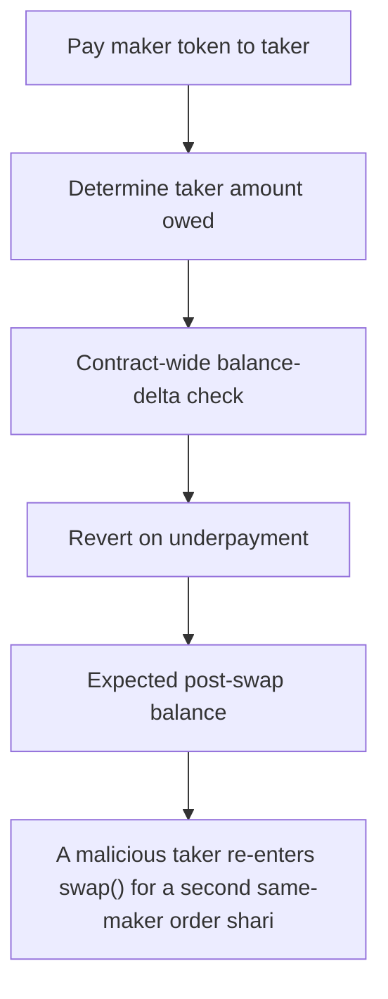

# Barter DAO: A malicious taker re-enters swap() for a second same-maker order sharing the same takerTok

> **Vulnerability classes:** vuln/theft
>
> **Reproduction:** a faithful minimal reproduction of the vulnerable finding — the vulnerable function is reproduced **verbatim** (marked `@>`) with faithful minimal doubles; local deploy, no fork.

<!-- source-auditvault: https://github.com/Auditware/AuditVault/blob/main/findings/63500-double-order-attack-via-callback-mechanism-mixbytes-none-bar.md -->

## Root cause

A malicious taker re-enters swap() for a second same-maker order sharing the same takerToken during the callback; that single payment satisfies the first order's post-callback balance-delta check too, so the taker collects makerToken from both orders while paying takerToken for only one — netting 100 STOLEN-MAKER (order #1's makerToken) for free while the maker is robbed of one full order.

```solidity
            order.takerToken.balanceOf(address(order.maker));

        // Check that callback provided enough tokens
        if (balanceAfter < balanceBefore + actualTakerAmount) { // @> post-callback balance-delta check with NO reentrancy guard: a concurrent same-maker order paying the SHARED takerToken satisfies this order's check too
            revert ReceivedLessThanMinReturn(
                balanceAfter,
```

## Why it's exploitable here

A malicious taker re-enters swap() for a second same-maker order sharing the same takerToken during the callback; that single payment satisfies the first order's post-callback balance-delta check too, so the taker collects makerToken from both orders while paying takerToken for only one — netting 100 STOLEN-MAKER (order #1's makerToken) for free while the maker is robbed of one full order.

## Attack path



## Marked-line walkthrough (Playground)

The EVM Playground pins each step to the exact executed source line in `0xe3a787a4e4…`:

1. **L119** — Pay maker token to taker: Sends the maker's tokens to the taker up front, before the taker callback — so both orders pay out before payment is checked.
2. **L124** — Determine taker amount owed: Selects what the taker must pay for this order — the partial `filledtakerAmount` or the full `takerAmount`.
3. **L136** — Contract-wide balance-delta check: Root cause: payment is verified by a whole-contract balance delta, not per order, so one re-entrant deposit satisfies two orders' checks at once.
4. **L137** — Revert on underpayment: Reverts if the measured balance increase falls short — but one shared payment passes both orders, so this never fires.
5. **L139** — Expected post-swap balance: The threshold the contract balance must reach; being a global snapshot, the double-order payment gets double-counted against it.
6. **L147** — Minimal reentrancy guard: Setup: a stripped reentrancy guard is defined, yet the taker re-enters `swap()` on a DIFFERENT order, a path this guard does not cover.
7. **L155** — Guard status check: The guard requires `_status == 1`; the double-order attack succeeds through the balance-delta flaw, not by evading this check.

## PoC

Registry (Foundry, local deploy — verbatim vulnerable source + harm-asserting test + negative control):

```bash
cd 63500-double-order-attack-via-callback-mechanism-mixbytes-none-bar_exp
forge test -vvv
```

The browser Playground replays the same synthetic opcode-for-opcode and measures the harm: **A malicious taker re-enters swap() for a second same-maker order sharing the same takerToken during the callback; that single payment satisf**. Both gates are green (registry `forge test` PASS + Playground `_verify-poc` **VERDICT: PASS**).
