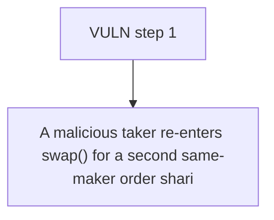

# Barter DAO: A malicious taker re-enters swap() for a second same-maker order sharing the same takerTok

> **Vulnerability classes:** vuln/theft
>
> **Reproduction:** a faithful minimal reproduction of the vulnerable finding — the vulnerable function is reproduced **verbatim** (marked `@>`) with faithful minimal doubles; local deploy, no fork.

<!-- source-auditvault: https://github.com/Auditware/AuditVault/blob/main/findings/63500-double-order-attack-via-callback-mechanism-mixbytes-none-bar.md -->

## Root cause

A malicious taker re-enters swap() for a second same-maker order sharing the same takerToken during the callback; that single payment satisfies the first order's post-callback balance-delta check too, so the taker collects makerToken from both orders while paying takerToken for only one — netting 100 STOLEN-MAKER (order #1's makerToken) for free while the maker is robbed of one full order.

```solidity
            order.takerToken.balanceOf(address(order.maker));

        // Check that callback provided enough tokens
        if (balanceAfter < balanceBefore + actualTakerAmount) { // @> post-callback balance-delta check with NO reentrancy guard: a concurrent same-maker order paying the SHARED takerToken satisfies this order's check too
            revert ReceivedLessThanMinReturn(
                balanceAfter,
```

## Why it's exploitable here

A malicious taker re-enters swap() for a second same-maker order sharing the same takerToken during the callback; that single payment satisfies the first order's post-callback balance-delta check too, so the taker collects makerToken from both orders while paying takerToken for only one — netting 100 STOLEN-MAKER (order #1's makerToken) for free while the maker is robbed of one full order.

## Attack path



## Marked-line walkthrough (Playground)

The EVM Playground pins each step to the exact executed source line in `0xe3a787a4e4…`:

1. **L136** — VULN step 1: post-callback balance-delta check with NO reentrancy guard: a concurrent same-maker order paying the SHARED takerToken satisfies this order's check too

## PoC

Registry (Foundry, local deploy — verbatim vulnerable source + harm-asserting test + negative control):

```bash
cd 63500-double-order-attack-via-callback-mechanism-mixbytes-none-bar_exp
forge test -vvv
```

The browser Playground replays the same synthetic opcode-for-opcode and measures the harm: **A malicious taker re-enters swap() for a second same-maker order sharing the same takerToken during the callback; that single payment satisf**. Both gates are green (registry `forge test` PASS + Playground `_verify-poc` **VERDICT: PASS**).
