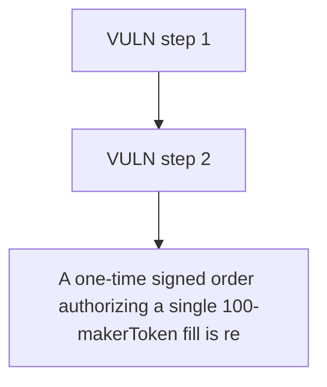

# Barter DAO: A one-time signed order authorizing a single 100-makerToken fill is replayed after the mak

> **Vulnerability classes:** vuln/theft · vuln/access-control
>
> **Reproduction:** a faithful minimal reproduction of the vulnerable finding — the vulnerable function is reproduced **verbatim** (marked `@>`) with faithful minimal doubles; local deploy, no fork.

<!-- source-auditvault: https://github.com/Auditware/AuditVault/blob/main/findings/63501-replay-attack-via-balance-based-nonce-mixbytes-none-barter-d.md -->

## Root cause

A one-time signed order authorizing a single 100-makerToken fill is replayed after the maker's balance recovers, filling it twice and draining 200 STOLEN-MAKER to the attacker EOA from one signature.

```solidity
        signed[orderHash] = true;
    }

    function approveToken(MiniToken token, address spender, uint256 amount) external {
        require(msg.sender == owner, "not owner");
        token.approve(spender, amount);
```

## Why it's exploitable here

A one-time signed order authorizing a single 100-makerToken fill is replayed after the maker's balance recovers, filling it twice and draining 200 STOLEN-MAKER to the attacker EOA from one signature.

## Attack path



## Marked-line walkthrough (Playground)

The EVM Playground pins each step to the exact executed source line in `0xbd4fd5a3ce…`:

1. **L114** — VULN step 1: balance used as a nonce: recovers -> order replayable
2. **L118** — VULN step 2: balance used as a nonce: recovers -> order replayable

## PoC

Registry (Foundry, local deploy — verbatim vulnerable source + harm-asserting test + negative control):

```bash
cd 63501-replay-attack-via-balance-based-nonce-mixbytes-none-barter-d_exp
forge test -vvv
```

The browser Playground replays the same synthetic opcode-for-opcode and measures the harm: **A one-time signed order authorizing a single 100-makerToken fill is replayed after the maker's balance recovers, filling it twice and draini**. Both gates are green (registry `forge test` PASS + Playground `_verify-poc` **VERDICT: PASS**).
