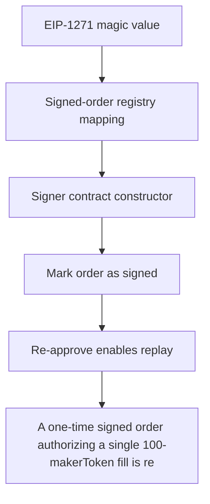

# Barter DAO: A one-time signed order authorizing a single 100-makerToken fill is replayed after the mak

> **Vulnerability classes:** vuln/theft · vuln/access-control
>
> **Reproduction:** a faithful minimal reproduction of the vulnerable finding — the vulnerable function is reproduced **verbatim** (marked `@>`) with faithful minimal doubles; local deploy, no fork.

<!-- source-auditvault: https://github.com/Auditware/AuditVault/blob/main/findings/63501-replay-attack-via-balance-based-nonce-mixbytes-none-barter-d.md -->

## Root cause

A one-time signed order authorizing a single 100-makerToken fill is replayed after the maker's balance recovers, filling it twice and draining 200 STOLEN-MAKER to the attacker EOA from one signature.

```solidity
        signed[orderHash] = true;
    }

    function approveToken(MiniToken token, address spender, uint256 amount) external {
        require(msg.sender == owner, "not owner");
        token.approve(spender, amount);
```

## Why it's exploitable here

A one-time signed order authorizing a single 100-makerToken fill is replayed after the maker's balance recovers, filling it twice and draining 200 STOLEN-MAKER to the attacker EOA from one signature.

## Attack path



## Marked-line walkthrough (Playground)

The EVM Playground pins each step to the exact executed source line in `0xbd4fd5a3ce…`:

1. **L105** — EIP-1271 magic value: Setup: the EIP-1271 `isValidSignature` magic return value used to validate the maker's signed order.
2. **L107** — Signed-order registry mapping: Setup: maps an order hash to whether the maker signed it — tracking validity, but not one-time consumption.
3. **L109** — Signer contract constructor: Setup: initializes the maker/signer contract.
4. **L115** — Mark order as signed: Records an order hash as authorized; this flag stays true, so the same signature keeps validating on repeat fills.
5. **L118** — Re-approve enables replay: Root cause: fill eligibility is gated by maker balance/allowance as an implicit nonce, so re-approving here lets one signed order fill twice.
6. **L166** — Consumed-order guard mapping: Declares a per-order `consumed` replay guard, but the fill path leans on maker balance instead, leaving the order replayable.
7. **L171** — Hash the order: Computes the order's hash used to look up its signed/consumed status when filling.

## PoC

Registry (Foundry, local deploy — verbatim vulnerable source + harm-asserting test + negative control):

```bash
cd 63501-replay-attack-via-balance-based-nonce-mixbytes-none-barter-d_exp
forge test -vvv
```

The browser Playground replays the same synthetic opcode-for-opcode and measures the harm: **A one-time signed order authorizing a single 100-makerToken fill is replayed after the maker's balance recovers, filling it twice and draini**. Both gates are green (registry `forge test` PASS + Playground `_verify-poc` **VERDICT: PASS**).
