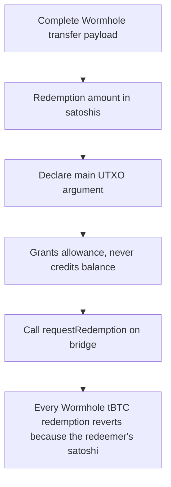

# Threshold: Every Wormhole tBTC redemption reverts because the redeemer's satoshi balance is never cre

> **Vulnerability classes:** vuln/locked-funds
>
> **Reproduction:** a faithful minimal reproduction of the vulnerable finding — the vulnerable function is reproduced **verbatim** (marked `@>`) with faithful minimal doubles; local deploy, no fork.

<!-- source-auditvault: https://github.com/Auditware/AuditVault/blob/main/findings/63508-requestredemption-reverts-because-l1btcredeemerwormholes-ban.md -->

## Root cause

Every Wormhole tBTC redemption reverts because the redeemer's satoshi balance is never credited in the Bank, so Bridge.requestRedemption's bank.transferBalanceFrom reverts ("Transfer amount exceeds balance") — bridged tBTC is permanently stranded (redemption-path DoS).

```solidity
    ) internal returns (uint256 redemptionKey, uint256 tbtcAmount) {
        // This contract (as balanceOwner) approves the Bridge to spend its Bank balance.
        // The amount for Bank allowance is in satoshi units (which is what `amount` already is).
        bank.increaseBalanceAllowance(address(thresholdBridge), amount); // @> grants the Bridge an allowance but NEVER credits this contract's Bank balance (the `tbtcVault.unmint` credit is missing) — Bridge.transferBalanceFrom later reverts

        // This contract calls the Bridge. The Bridge will see `msg.sender` (this contract) as the `balanceOwner`.
```

## Why it's exploitable here

Every Wormhole tBTC redemption reverts because the redeemer's satoshi balance is never credited in the Bank, so Bridge.requestRedemption's bank.transferBalanceFrom reverts ("Transfer amount exceeds balance") — bridged tBTC is permanently stranded (redemption-path DoS).

## Attack path



## Marked-line walkthrough (Playground)

The EVM Playground pins each step to the exact executed source line in `0xcc0e8eedd7…`:

1. **L371** — Complete Wormhole transfer payload: Setup: `completeTransferWithPayload` finalizes the inbound Wormhole tBTC transfer and returns the encoded redemption payload.
2. **L389** — Redemption amount in satoshis: Setup: supplies `amountInSatoshis`, the bridged tBTC amount in satoshi units that the redemption is meant to move.
3. **L397** — Declare main UTXO argument: Setup: declares the `mainUtxo` parameter the wallet uses to fund this Bitcoin redemption request.
4. **L403** — Grants allowance, never credits balance: Root cause: only calls `increaseBalanceAllowance` for the bridge but never credits the redeemer's Bank satoshi balance, leaving it at zero.
5. **L406** — Call requestRedemption on bridge: Invokes `requestRedemption`, whose internal `transferBalanceFrom` reverts 'Transfer amount exceeds balance' because the balance was never credited.
6. **L418** — Read back redemption request: Would fetch the stored `RedemptionRequest`, but this line is never reached since `requestRedemption` already reverted.
7. **L428** — Redemption amount field: Setup: `redemptionAmountSat` is the request struct's satoshi amount, part of the record the reverting call never gets to create.

## PoC

Registry (Foundry, local deploy — verbatim vulnerable source + harm-asserting test + negative control):

```bash
cd 63508-requestredemption-reverts-because-l1btcredeemerwormholes-ban_exp
forge test -vvv
```

The browser Playground replays the same synthetic opcode-for-opcode and measures the harm: **Every Wormhole tBTC redemption reverts because the redeemer's satoshi balance is never credited in the Bank, so Bridge.requestRedemption's b**. Both gates are green (registry `forge test` PASS + Playground `_verify-poc` **VERDICT: PASS**).
