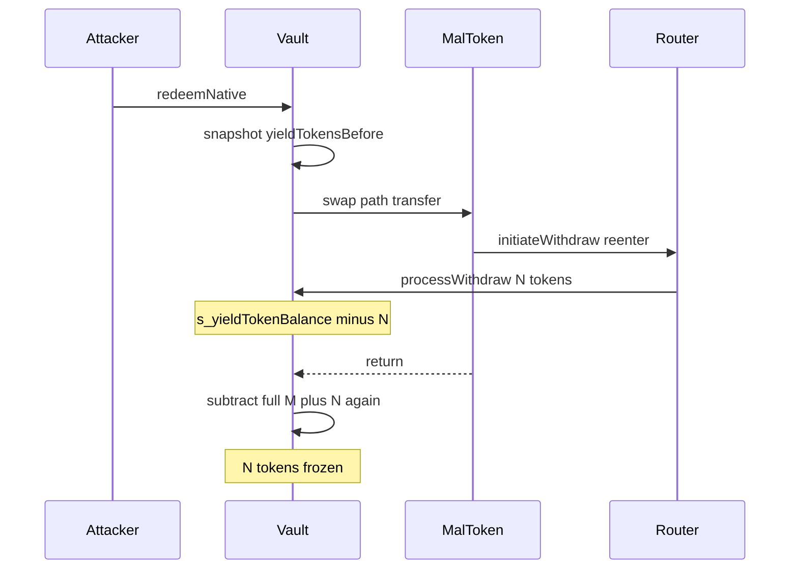

# Notional v4 — redeemNative reentrancy freezes yield tokens

> **Vulnerability classes:** single-function reentrancy · locked-funds · accounting desync

> **Reproduction:** reduced synthetic of AbstractYieldStrategy double-subtract path.

<!-- non-defihacklabs -->
<!-- source-auditvault: https://github.com/Auditware/AuditVault/blob/main/findings/63524-redeemnative-reentrancy-enables-permanent-fund-freeze-system.md -->
<!-- date: 2025-01 -->

**AuditVault taxonomy:** `severity/high` · `sector/lending` · `platform/mixbytes` · `single-function` · `locked-funds` · `reentrancy-guard`

---

## Key info

| | |
|---|---|
| **Impact** | **HIGH** — yield tokens frozen (balance > s_yieldTokenBalance); share price distortion |
| **Protocol** | Notional Finance v4 AbstractYieldStrategy |
| **Vulnerable code** | `_burnShares` subtracts full pre-reentrancy delta after reentrancy already moved N |
| **Bug class** | Reentrancy during redeem trade |
| **Finding** | MixBytes · Notional v4 · #63524 |

---

## TL;DR

`redeemNative` snapshots balance, swaps via a path including a malicious token that reenters `initiateWithdraw` (moves N yield tokens and decrements accounting). After return, burn subtracts (M+N) again → N tokens unaccounted/frozen.

## The vulnerable code

```solidity
s_yieldTokenBalance -= yieldTokensRedeemed; // @> VULN double-count after reentrancy
// FIX: nonReentrant on redeem/initiateWithdraw; restrict UniV2 path length
```

## Diagrams



## Impact

Permanent freeze of vault yield tokens; collateral health distortion and liquidation risk.

## Sources

- [AuditVault #63524](https://github.com/Auditware/AuditVault/blob/main/findings/63524-redeemnative-reentrancy-enables-permanent-fund-freeze-system.md)
- [MixBytes Notional v4](https://github.com/mixbytes/audits_public/blob/master/Notional%20Finance/Notional%20v4/README.md)
- Fix: notional-finance/notional-v4#34
