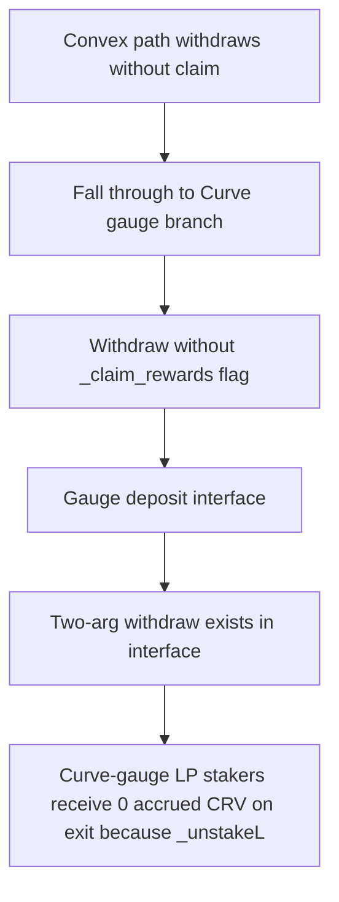

# Notional Finance: Curve-gauge LP stakers receive 0 accrued CRV on exit because _unstakeLpTokens calls withdr

> **Vulnerability classes:** vuln/locked-funds · vuln/reward-accounting
>
> **Reproduction:** a faithful minimal reproduction of the vulnerable finding — the vulnerable function is reproduced **verbatim** (marked `@>`) with faithful minimal doubles; local deploy, no fork.

<!-- source-auditvault: https://github.com/Auditware/AuditVault/blob/main/findings/63525-inability-to-claim-rewards-from-the-curve-gauge-mixbytes-non.md -->

## Root cause

Curve-gauge LP stakers receive 0 accrued CRV on exit because _unstakeLpTokens calls withdraw(poolClaim) without the _claim_rewards flag (defaults False) and no reward-manager claim path exists, so 1000 CRV stays locked in the gauge, undelivered.

```solidity
            bool success = IConvexRewardPool(CONVEX_REWARD_POOL).withdrawAndUnwrap(poolClaim, false);
            require(success);
        } else {
            ICurveGauge(CURVE_GAUGE).withdraw(poolClaim); // @> no _claim_rewards flag (defaults False) & no reward-manager claim path -> accrued CRV never delivered on unstake
        }
    }
```

## Why it's exploitable here

Curve-gauge LP stakers receive 0 accrued CRV on exit because _unstakeLpTokens calls withdraw(poolClaim) without the _claim_rewards flag (defaults False) and no reward-manager claim path exists, so 1000 CRV stays locked in the gauge, undelivered.

## Attack path



## Marked-line walkthrough (Playground)

The EVM Playground pins each step to the exact executed source line in `0xe3a787a4e4…`:

1. **L190** — Convex path withdraws without claim: The Convex branch calls `withdrawAndUnwrap(poolClaim, false)`, unwrapping the LP but passing false so rewards aren't claimed here either.
2. **L192** — Fall through to Curve gauge branch: Setup: the `else` selects the Curve gauge exit path taken when the position is staked directly in the gauge.
3. **L193** — Withdraw without _claim_rewards flag: Root cause: calls single-arg `withdraw(poolClaim)`; `_claim_rewards` defaults False, so accrued CRV is never pulled and stays stuck in the gauge.
4. **L201** — Gauge deposit interface: Setup: declares the gauge's `deposit` function in the interface.
5. **L202** — Two-arg withdraw exists in interface: The interface exposes `withdraw(_value, _claim_rewards)` — the claim-enabling overload the exit path should have called instead.
6. **L212** — Store Convex reward pool address: Setup: immutable `CONVEX_REWARD_POOL` holds the Convex pool address used by the other exit branch.

## PoC

Registry (Foundry, local deploy — verbatim vulnerable source + harm-asserting test + negative control):

```bash
cd 63525-inability-to-claim-rewards-from-the-curve-gauge-mixbytes-non_exp
forge test -vvv
```

The browser Playground replays the same synthetic opcode-for-opcode and measures the harm: **Curve-gauge LP stakers receive 0 accrued CRV on exit because _unstakeLpTokens calls withdraw(poolClaim) without the _claim_rewards flag (def**. Both gates are green (registry `forge test` PASS + Playground `_verify-poc` **VERDICT: PASS**).
